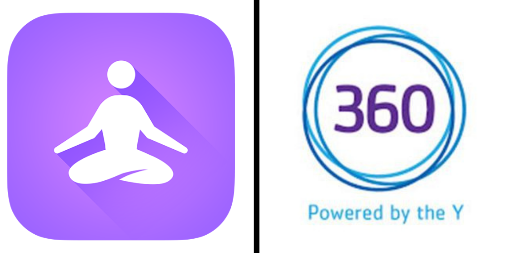
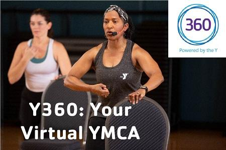
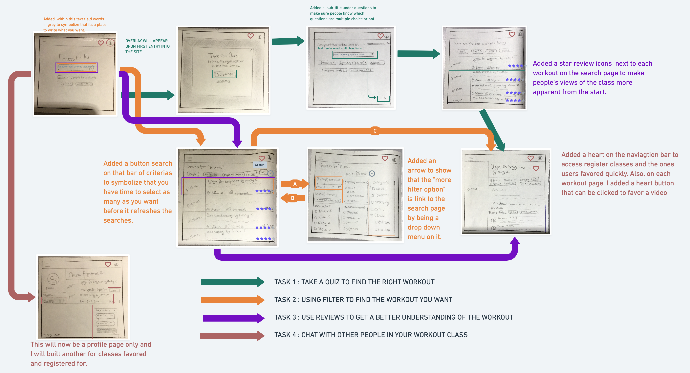
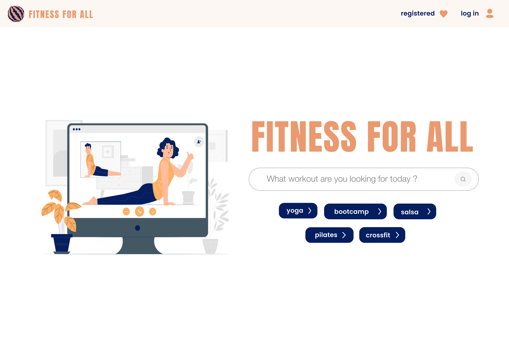
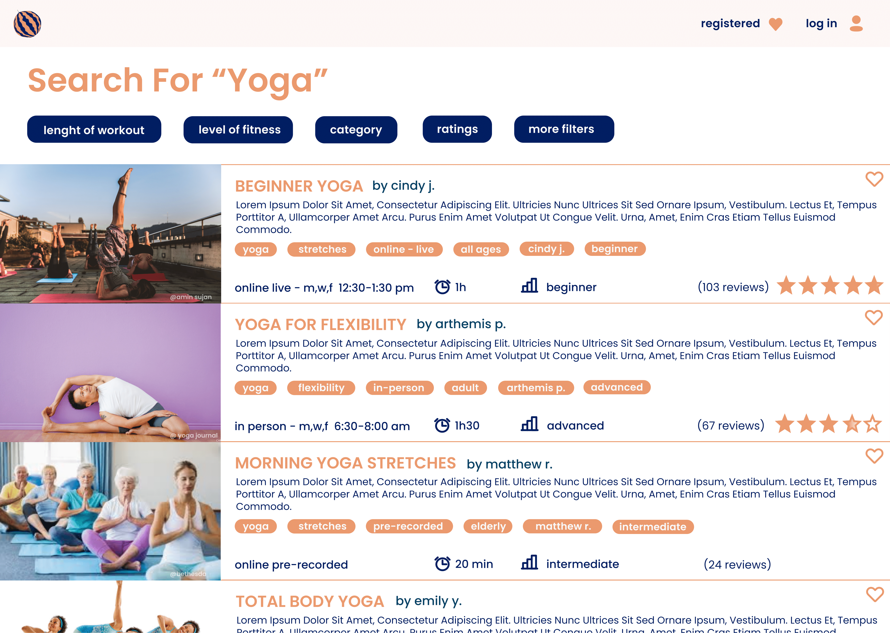
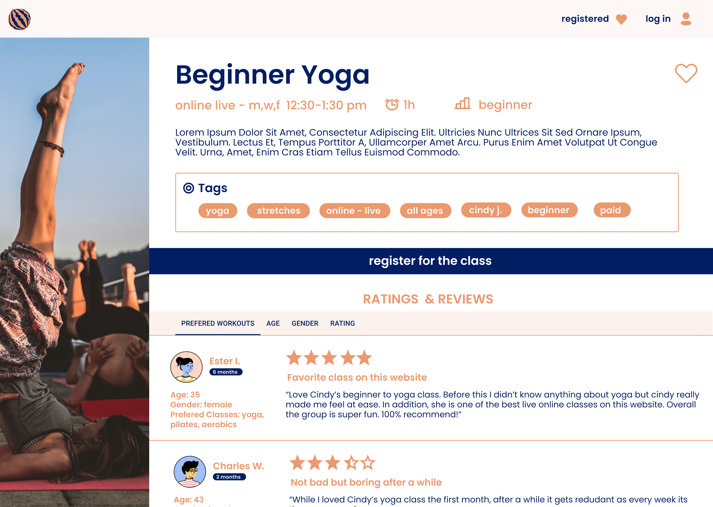
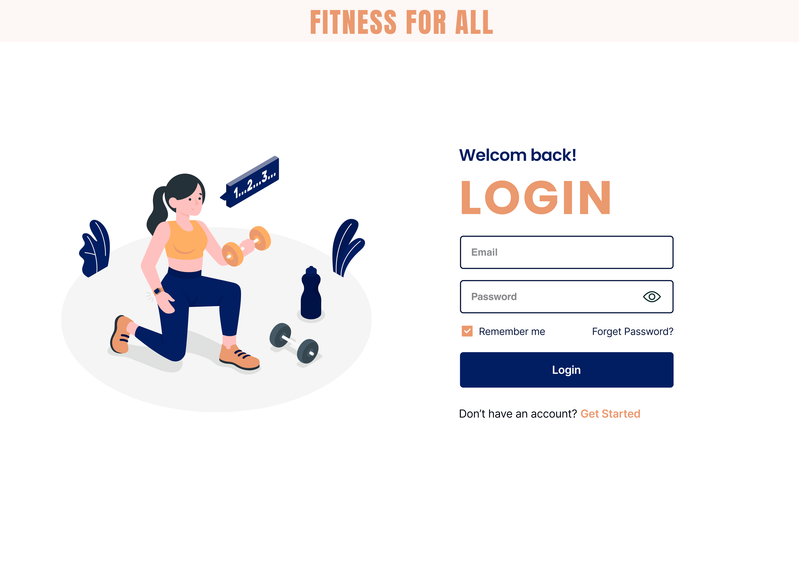
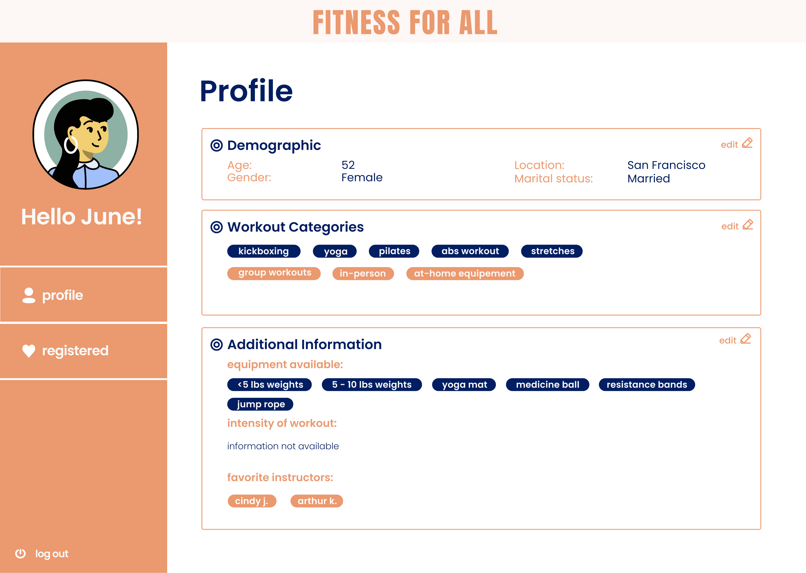
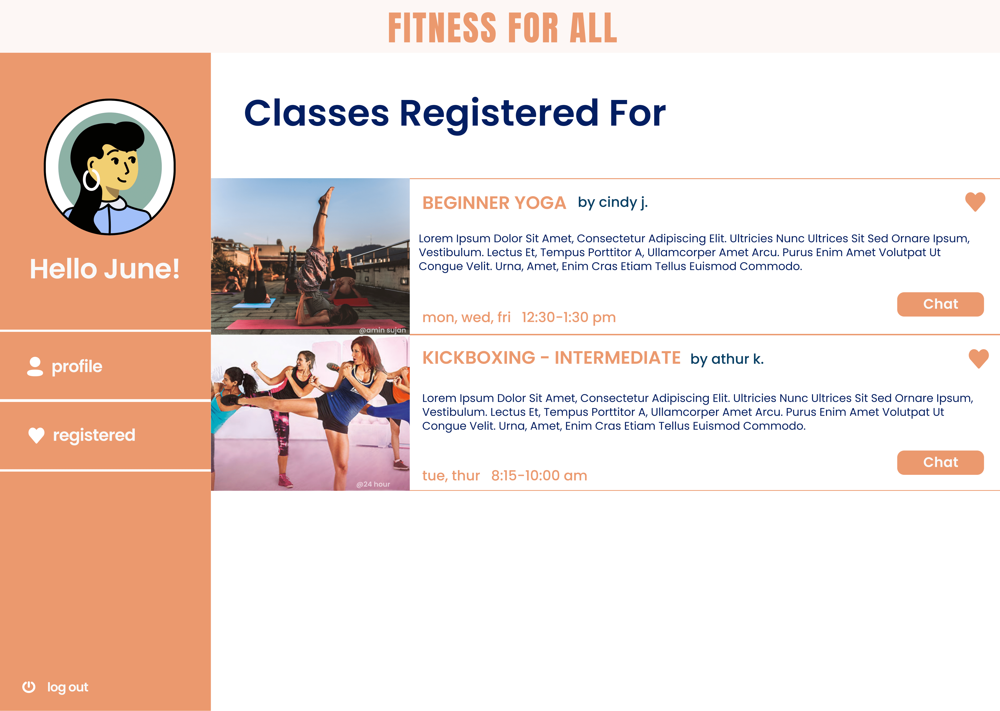
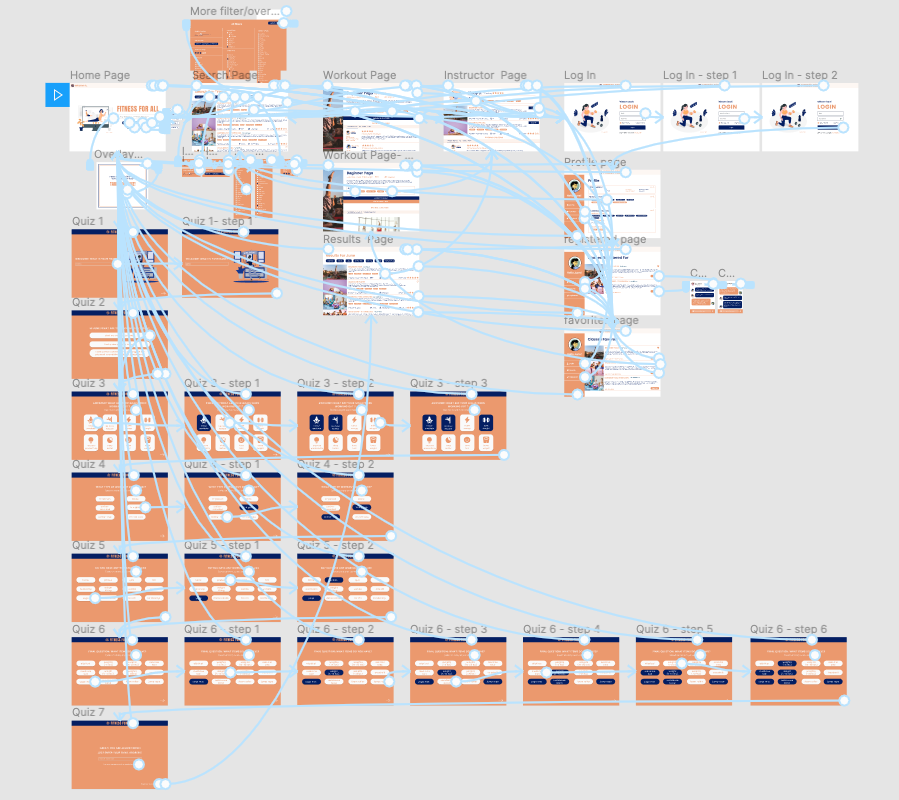

# Fitness for All: Making Fitness Fun and Accessible at All Times 
### *Alix Le Boterff, Digital Humanities 150: UX/UI Design, Fall 2020*

###### *Credits: RUN 4 FFWPU on Pexels*

## About this Project
This quarter's goal is to create a UX project that promotes well-being for middle age women. As we age, it is crucial to continue physical exercise on a daily basis to keep muscle mass and boost immune system and with the pandemic and people staying at home, it has been hard to be as active and work out. Being active is an essential part to well-being. It can often times be a pleasureful experience that helps feel happier overall and more concentrated and energetic.

However, online exercises classes are often either tailored to young adults and very fit individuals or on the opposite end of the spectrum elderly people and middle-age women sometimes feel left out of the equation. They are far more active and dynamic than elderly people but can also feel intimidated by intensive HIIT training targeted at a younger audience. Hence, my project would focus on a user-centric platform for fitness and well-being targeted at middle-age women. This platform will be easy to use and allow users to find all the fitnesses courses out there and see which ones are the best for them depending on variables such as time committment, prices, in-person or vitual, at home equipement or gym equipement, level of intensity etc. It will also create a community for my audience around the topics of fitness and well-being.

## Design Statement and Community Contribution

Through my UX design project, I hope to impact the lives of mid-age women (and potentially others) by offering an easy and seamless experience for people to find fitness programs/classes/exercises that fit into their schedule and help them stay in good health both physically and mentally. I also hope to incorporate a social aspect to this app to create a community around the topic of fitness habits. 

Based on the research below, I decided to create 3 design features that I believe will help users feel incentive to workout and more confident in their choices of workout: 
* **Filters:** create an extensive possibility of filter options and categorize them easily based on needs that users may have when working out. This will allow them to  easily narrow down their choices from the thousands of options available to them on the internet. Some examples of those filters are: type of workout, level of intensity, lengths, targeted area of the body, equipment needed, type of workout (images, videos, prerecorded, live, in person, virtual), price, etc.
* **Social reviews:** the ability to have an account on the site and interact with other of the site members through chats and trusted reviews. Like the Sephora website, the reviews will give some description of who the reviewer is in order to see what people similar to you have said about the particular workout and help you see if it may fit your needs. It creates a more social component that currently cannot be recreated due to the social distancing. 
* **Quiz function:** to help beginners or people with recent changes in their capabilities (injuries, pregnancies etc.) understand what are their needs and offer them initial options to see which they like and do not like. 

## Competitor Analysis

### Heuristic evaluation
The first step of the project was to look at websites focused on the same subject as this project,fitness, and see how they pass the Nielson's 10 Heuristic evaluation. Because of my topic and my audience, I choose to evaluate the website of the YMCA for online exercise classes, [YMCA 360](https://ymca360.org/on-demand), that sources videos from their gyms across the country and tries to meet the needs of all age groups. I also choose the app, [Yoga For Beginners](https://apps.apple.com/us/app/yoga-for-beginners-mind-body/id1382141225), that offers free yoga courses as well as detailed explanations of each pose. 

### Find the full evaluation [here](assignment1/heuristicevaluation.md)

Both the YMCA 360 and Yoga for Beginners are easy and intuitive to navigate through, making users instantly feel in control. However, both have some serious heuristic violations that make part of the user experience confusing and uncomfortable. As the goal of my project is to promote healthy fitness habits from middle-age women by making it easy and enticing to them, I have marked a couple point that truly stood out during this evaluation:
* It is important not to use fitness jargon. Instead, to meet the criteria of heuristic principle 2, ***Match between system and real world***, titles and descriptions of workouts should focus more on the benefits they bring and how they may fulfill the needs the user may feel they have when it comes to working out (legs strengthen, destress, cardio, arm workout etc)
* Secondly the user needs to be in control, heuristic principle 3, ***User Control and freedom***. Especially during the workout, the user must be able to pause, play, rewind, slow down the video all while being able to leave easily. This will allow the user to not feel pressure to get the movement right on the spot or to not take any breaks. It is important that everyone be able to go at their own rhythm so they can have fun.
* Finally, it is crucial to have proper documentation (FAQ) and, heuristic principle 10 - ***Help and documentation***, contact forms to get feedback. Especially with first time or less tech-savvy users, it is crucial to have a clear help guide accessible from all pages to help them truly understand how the platform works and how to achieve their goals. 

### Usability Testing

After conducting a heuristic evaluation on it, I realized multiple principles were being violated and I decided to look further into this website and see how my target audience reacts when using it to perform simple tasks. I started by a pilot Usability Test and focused on 3 main tasks:playing a workout video,finding the FAQ, using the favoring video function.My goal with this experiment was to see if my Usability Test material was effective and in term better understand the usability experience of target users to then utilise those finding on my website.

### Find the full usability testing [here](assignment2/usabilitytesting.md)

This pilot usability testing aided me to fully understand the point of view of my target audience as well as validate some of my previous assumptions I made after the heuristic evaluation.
*  I saw that the participant had no issues with finding a workout video and playing it but she did struggle with ***finding the FAQ and the favorite video folder.*** 
* The participant did find the website overall ***easy to use and doesn’t require technical support*** to make it work but ***can be better integrated.***

From this competitor analysis, I realized the importance of creating not only an efficient user experience to access the workout videos but also a great experience for other important functions of the website such as finding the FAQ, login in, favoring a video etc.

## User Research - Contextual Inquiry

After conducting UT, I decide to expand pass competitors website and see how users look for fitness classes through the internet in general. I wanted to know how they started their research, what keywords they used and and what ultimately made them decided to go for a certain workout type/class. To do, so I set up a **participatory observation** where I asked the users questions about how they looked for workout classes online, and then watch then choose a class through online research and perform said workout. At the end, I asked them whether or not they were satisfied with the workout and the process in general. I told them not to go for website they usually go for straight away (as they have them saved) but start fresh looking on the internet. 

### Find the full contextual inquiry [here](assignment3/contextual.md)

During the interview, the user did feel very frustrated when doing the tasks and left dissatified. Her responces proved the need for a project like mine that allows to streamline the search process and make the experience efficent and stress-free for the use. Here are the key insights gathered from this contextual inquiry:
* Experience is **overwhelming and takes too long**
* Friends opinion & **social aspect of working out** matter a lot.
* **Too much information online/lack of filters** makes the research frustrating at times.
* **Price matters.** 
* Users look at **pictures of the workout** as a way to guage what the workout will be like. 

## UX Storytelling - User Personas & Scenarios

UX Storytelling reminds the researchers and designers that the experience must be user-centered. By think no longer websites based on heuristic principles and user interviews as data points, UX storytelling allows researcher to reflect on the underlying feeling and desires that users may have when completing the task and assuring that those are being satisfied by the results of the project. By creating personas, I will be able to think as the target users more generally and understand better how the current system in place does not meet their goals.

During my research, I created 3 personas: **June - the recent retiree  :family_woman_girl_boy:   , Mary - the social butterfly :butterfly:         & Evalyn - the busy bee  :honeybee:  .**

I identified their needs, challenges and goals as well as created an empathy map to better understand how they felt during the process. I then used this new found understanding of my audience to create scenarios about how my key design features would help them solve any frustration they may have had during that process. 

### Find the full personas and scenarios [here](assignment5/personas.md)

 From this research, I was able to understand how my project should focus on **resolving any frustration in the fitness process my user had (user-centric approach).** Additionally, it reaffirms the validity of the needs for more **filters, a quiz and a social component in fitness apps which is the key features of my project.**

## Low-Fidelity Prototype

The purpose of this low-fidelity prototype is start planing the flow of my website as well as how each frame would look like in order to assure functionality for the users. My goal is to keep in mind my user-centric research and apply it to this low-fidelity prototype to ensure that it actually solved the user problem. I am then particularly excited to have a target audience member go through the wireframe and point out any areas that might be confusing.

In this wireframe, I tested out 4 tasks:
1. Take a quiz to find the right workout.
2. Use filters to find the workout you want faster. 
3. View reviews to get better understanding of the workout. 
4. Chat with people in your workout class.
### Find the full Low-Fidelity Prototype and testing [here](assignment6/low_fidelity.md)

After testing the wireframes & wireflow on a participant, I revised my wireframe and ended up with this low-fidelity prototype:

After testing the wirefram  I have found multiple areas of confusion for the customer:
* **The interaction sequence** was unclear and lacked arrows or more obvious pathways.
  * Solution: I will first take out the navigation bar on the home page and add an arrow to symbolize that the "more filter option" is a dropdown menu on the search page.
* **Search bar** on the quiz seemed confusing to the user. 
  * Solution: Replace the search bar with multiple choice questions. 
* There was confusion over the fact the **star next to a grade out of five** was an insight on what others had thought of the workout.
  * Solution: Change it to a 5 star system and write (# of reviews) next to it to showcase what people have thought of the workout.
* What I had planed as a profile page, she saw as a page solely for **classes one was registered for.**
  * Solution: Through her confusion, I was reminded of the recall vs recognition heuristic principle and realize it might be more useful to keep this link to a profile page as simply that but add a icon (probably of a heart) on the naviagtion bar where people could easily access their favorite classes. 

## High-Fidelity Prototype

This high-fidelity prototype is a great way to incorportate all the research I have done over the last 6 weeks into one final mockup. By building this prototype, I aim to get design a website and see what are the usability aspects (color contrast, heuristic principles,etc) that need to be improve. I also am trying to guage what is the most intuitive flow possible for my target audience.

#### Graphical Design Interface - Decision making 

My decision making process too place in multiple steps. I first decided to create 3 prototypes. Each had similar structural organization based on the low-fidelity model I create last week but varied in color scheme, typography and images. For the color scheme, I looked at some accessibilty color palettes that normally would have a large enough color contrast ratio that I later rested (see **accessibility section** below). I then played around with multiple typographies before landing on 3 different 2-3 font combo. Once I had created the prototypes, I checked accessibility and then did an impression test to see what my target audience thought of my prototypes. From there, I choose my final Graphical Design protoype

###  Interactive High-Fidelity Prototype 

#### Screen Designs
Here are some of the most important screens of my website. They all have the same look and feel and are related by a lof of different passways. 

||||
|--------------|----------|---------------|
|**Home Page**|**Search Page**|**Workout Page**|
||||
|**Login Page**|**Profile Page**|**Registered Classes Page**|

#### Wireframe

**To view the prototype wireflow on figma click [here](https://www.figma.com/file/O7fSlTmmPFmKkmCB7OhPwB/150-Final-Project-week-8?node-id=0%3A1)

**To view the full interactive high-fidelity prototype on figma click [here](https://www.figma.com/proto/O7fSlTmmPFmKkmCB7OhPwB/150-Final-Project-week-8?node-id=5%3A2989&viewport=157%2C258%2C0.06684868782758713&scaling=contain)

## Evaluation and Revision

During the High-Fidelity Prototype, I had the chance to get feedback from feedback from my target user through an impression test to decide what design scheme to pick as well as feedback from my peers during a cognitive walkthrough later on. These tests allowed me to pinpoint weaknesses in my design and rectify them. 

### Impression test
I asked a person in my target demographic to look over all 3 prototype for 20 seconds each while saying out loud what they like and dislike about each. I then asked them their favorite and any other feed back they may have.

To view the impression test click [here](https://drive.google.com/file/u/1/d/1aNxks7jcqvUBDn16wcsvn9CurTiZAMTS/view?usp=sharing)

Overall, the participant liked prototype 2 the best and prototype 3 the least. She didn't like the monochromatic look and feel of the prototype 3 nore its more funky font. She also noted that the buttons were way to small for her or anyone her age and that it might be best to enlarge them. Overall protype 2 was the winner even thought she also did like the font and image on protype 1.

### Cognitive Walk-Through

Cognitive walk-throught questions examiners about the overall look of the project as well asks them to complete a set of task and question how easy or not it was to complete. I did one for everyone of my tasks and recorded a screenshot of the userflow.

#### Task 1 - Filters 
> In this task, the user will be Evalyn, a persona that wants to use the filters to find the workout she is looking for more easily.

*See [video of walkthrough](https://drive.google.com/file/d/17BimIqeHTOu0yMdfrw9eXBtr2Jv4KXku/view?usp=sharing) and read the [Comments](https://docs.google.com/document/d/1W5ElvFpQNlcbxCVg8f6cE9sfT5EHaioIs9VUQIuPaAk/edit?usp=sharing) for this task.*

 Key takeways/Things to improve on:
 * Add an input field interaction to the home page search button. 
 * Fix the scrolling for the category filter and instructor filter in the more filter options. 
 
#### Task 2 - Reviews
> In this task, the user will be Mary, a persona who wants to see other people’s review of the class before joining . 

*See [video of walkthrough](https://drive.google.com/file/d/1hJBQK4Y2kSr7yeT3PsaiW-zsuMIrmHrI/view?usp=sharing) and read the [Comments](https://docs.google.com/document/d/1wz4o1-zOp3biWcmOOsmriijSefu9R2TCff5QE_Jn1kk/edit?usp=sharing) for this task.* 

 Key takeways/Things to improve on:
 * Change the wording on the registered class page to match what it below it. 

#### Task 3 - Chat
> In this task, the user will be June, a persona that chat with pals in the workout classes she is registered for.

*See [video of walkthrough](https://drive.google.com/file/d/1YEcNA0M69gDZXaZX22_DwoHmauextmMR/view?usp=sharing) and read the [Comments](https://docs.google.com/document/d/1Q6pV6OsrCXwJkiJBS1TBd5Qo1B6gzKrW-JYKaLCHx2g/edit?usp=sharing) for this task.* 

 Key takeways/Things to improve on:
 * Create a hover over the side buttons. 
 * Change the color of the register button to dark blue to match the other register buttons onsite and differenciate from the registered's chat buttons. 

#### Task 4 - Quiz
> In this task, the user will be June, a persona that is starting to workout and takes a quiz to get workouts that are right for her. 

*See [video of walkthrough](https://drive.google.com/file/d/1gV6boAQ_60jtHYWhfJrNKaPjoHwPDiLO/view?usp=sharing) and read the [Comments](https://docs.google.com/document/d/1hnmmZqxYJOUKDXGOdrcz_oYNcGmHNsQTQkL4TyboKqA/edit?usp=sharing) for this task.* 

 Key takeways/Things to improve on:
 * forgot to put an email field push button on the last step of the quiz.
 * one of the text on most of the quiz frame seem to have a interaction that does nothing when it is suppose to have none.
 
All these evaluations allowed me to modify and perfect my prototype to the version you see above. 

## Pitch Video

## Conclusion of the project
