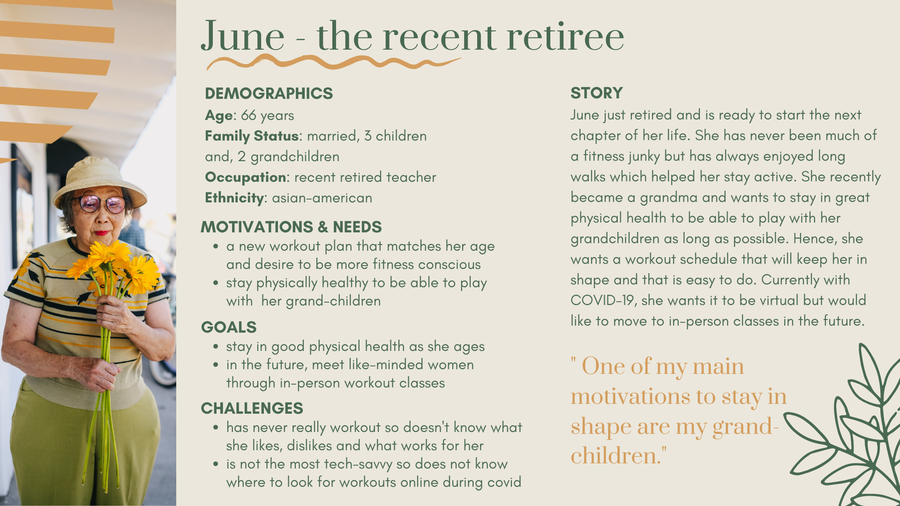
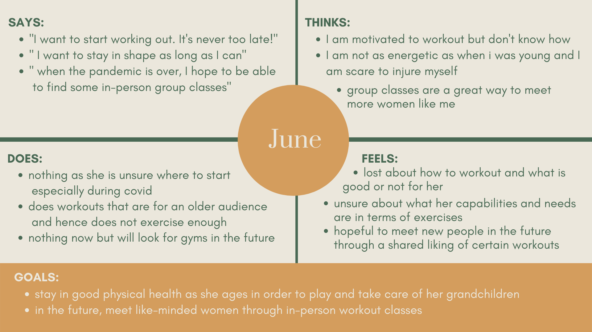
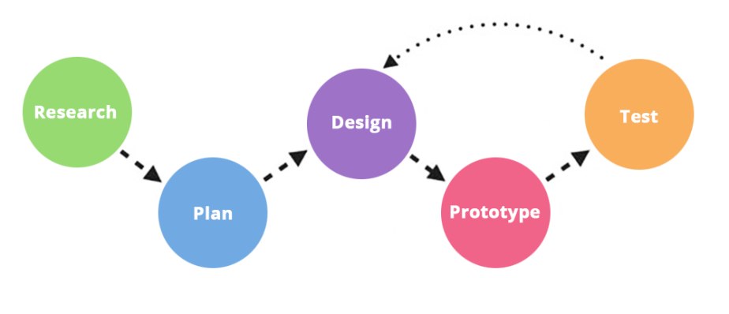

# Fitness for All: Making Fitness Fun and Accessible at All Times 
### *Alix Le Boterff, Digital Humanities 150: UX/UI Design, Fall 2020*

###### *Credits: RUN 4 FFWPU on Pexels*

## About this Project
This quarter's goal is to create a UX project that promotes well-being for middle age women. As we age, it is crucial to continue physical exercise on a daily basis to sustain muscle mass and boost immune system. However, with the pandemic forcing people staying at home, it has been hard to be active and work out. Being active is not only an essential part to well-being but also can be a pleasureful experience that helps feel happier, more concentrated and more energetic.

The problem is that online exercises classes are often either tailored to young adults and very fit individuals or on the opposite end of the spectrum, elderly people. Hence, middle-age women sometimes feel left out of the equation. Hence, my project focuses on a user-centric platform for fitness and well-being made for middle-age women. This platform will  allow users to find easily all the fitnesses courses available on the internet and see which ones are the best for them depending on variables such as time commitment, price, in-person or vitual, at home or gym equipement, level of intensity, etc. It will also create a community for my audience around the topics of fitness and well-being.

## Design Statement and Community Contribution

**Through my UX design project, I hope to impact the lives of mid-age women and others by offering an easy and seamless way to find fitness programs/classes/exercises that fit into their schedule and help them stay in good health both physically and mentally and creating a community around  fitness health.**

Based on the research below, I decided to create 3 design features that will help users feel incentivized to workout as well as feel more confident in their workout choices: 
* **Filters:** Create an extensive possibility of filters and categories based on needs users may have when working out allowing them to easily narrow down their choices from the thousands of options currently available on the internet. Some examples of those filters are: level of intensity, length of workout, equipment needed, type of workout (images, videos, prerecorded, live, in person, virtual), price, etc.
* **Social reviews:** Offer the ability to have an account on the site and interact with other site members through chats and trusted reviews. Like the Sephora website, the reviews will give some descriptions of who the reviewer is in order to see what people similar to you have said about the particular workout and help you see if it may fit your needs. It creates a more social component that cannot be currently possible when working out due to the social distancing. 
* **Quiz function:** Help beginners or people with recent changes in their capabilities (injuries, pregnancies, etc.) understand what are their needs and offer them initial workout options targeted to see which they like and do not like. 

## Competitor Analysis

### Heuristic evaluation
The first step of the project was to look at websites focused on the same subject as this projec and see how they pass the Nielson's 10 Heuristic evaluation. Because of my topic and my audience, I choose to evaluate the website of the YMCA for online exercise classes, [YMCA 360](https://ymca360.org/on-demand), that sources videos from their gyms across the country and tries to meet the needs of all age groups as well as the app, [Yoga For Beginners](https://apps.apple.com/us/app/yoga-for-beginners-mind-body/id1382141225), that offers free yoga courses as well as detailed explanations of each pose. 

 

#### Find the full evaluation [here](assignment1/heuristicevaluation.md)

Both the YMCA 360 and Yoga for Beginners are easy and intuitive to navigate, making users feel instantly in control. However, they also have some serious heuristic violations making part of the user experience confusing and uncomfortable. As the goal of my project is to promote healthy fitness habits from middle-age women by making it easy and enticing to them, I have marked a couple point that truly stood out during this evaluation:
* It is important not to use fitness jargon. Instead, to meet the heuristic principle #2, ***Match between system and real world***, titles and descriptions of workouts should focus more on the benefits they bring and how they may fulfill the user's needs (e.g. legs strengthen, destress, cardio, arm workout etc)
* Secondly the user needs to be in control, heuristic principle #3 - ***User Control and freedom***. Especially during the workout, the user must be able to pause, play, rewind, slow down the video all while being able to leave easily. This will allow the user to not feel pressure to get the movement right on the spot or to not take any breaks. It is important that everyone be able to go at their own rhythm so they can have fun.
* Finally, it is crucial to have proper documentation (FAQ) and as the heuristic principle #10 - ***Help and documentation*** says contact forms to get feedback. Especially with first time or less tech-savvy users, websites need a clear help guide accessible from all pages to help users truly understand how the platform works and how to achieve their goals. 

### Usability Testing

After conducting a heuristic evaluation on my potential competitors, I realized multiple principles were being violated and I decided to look further into the YMCA 360 website and see how my target audience reacts when using it to perform simple tasks. I started by a pilot Usability Test and focused on 3 main tasks: playing a workout video, finding the FAQ, and using the favoring video function. My goal with this experiment was to see if my usability test material was effective and in term, better understand the usability experience of target users and their pain points.

Here is the usability test:

<figure class="video_container">
  <iframe src="https://drive.google.com/file/d/1ygt46HoM13mTEJhy335HvhWVZN9AJc7N/preview" width="600" height="450"></iframe>
</figure>

#### Find the full usability testing [here](assignment2/usabilitytesting.md)

This pilot usability testing aided me to better understand the point of view of my target audience as well as validate some of my previous assumptions I had made.
*  I saw that the participant had no issues with finding a workout video and playing it but she did struggle with ***finding the FAQ and the favorite video folder.*** 
* The participant did find the website overall ***easy to use and didn’t require technical support*** to make it work but thought it ***could be better integrated.***

***From this competitor analysis, I realized the importance of creating not only an efficient user experience to access the workout videos but also a great experience for other important functions of the website such as finding the FAQ, login in, favoring a video etc. However, I was left wondering how my users would interact with the product during a typical workout.***

## User Research - Contextual Inquiry

After conducting UT, I decide to expand past my competitors websites and see how users look for fitness classes through the internet in general. I wanted to know how they started their research, what keywords they used and and what ultimately made them decided to go for a certain workout type/class. To do so, I set up a **participatory observation** where I asked the participant questions about how they looked for workout classes online, and then watch them choose a class through online research and perform said workout. At the end, I asked them whether or not they were satisfied with the workout and the process in general. I told them not to go for website they usually go for straight away (as they have them saved) but start fresh looking on the internet. 

#### Find the full contextual inquiry [here](assignment3/contextual.md)

During the interview, the user did feel very frustrated when doing the tasks and left dissatified. Her responces proved the need for a project like mine that allows to streamline the search process and make the experience efficent and stress-free for them to use. Here are the key insights gathered from this contextual inquiry:
* Experience is **overwhelming and takes too long**
* Friends opinion & **social aspect of working out** matter a lot.
* **Too much information online/lack of filters** maked the research frustrating.
* **Price matters.** 
* Users look at **pictures of the workout** as a way to gauge what the workout will be like. 

***From this contextual inquiry, I was able to better view how my target audience tried to search for a workout and performed one and mark their pain points along the way. I realized that the whole experience can be quite frustrating and that having a trusted site with filters would allow to streamline the process efficently. After doing so much research on competitors website, I felt that it was time to take in all the insights I gathered and created personas of users that would use my website.***

## UX Storytelling - User Personas & Scenarios

UX storytelling reminds the researchers and designers that the experience must be user-centered. By no longer thinking of websites through on heuristic principles and competitors analysis, UX storytelling allows researcher to reflect on the underlying feelings and desires that users may have when completing tasks and ensuring that those are being satisfied by the project. By creating personas, I will be able to think as the target users more generally and understand better how the current system in place does not meet their goals.

During my research, I created 3 personas: **June - the recent retiree  :family_woman_girl_boy:   , Mary - the social butterfly :butterfly:         & Evalyn - the busy bee  :honeybee:  .**

I identified their needs, challenges and goals as well as created an empathy map to better understand how they felt during the process. I then used this new found understanding of my audience to create scenarios about how my key design features would help them solve any frustration they may have had during that process. 

Here is the example of June's persona and empathy map:

|||
|------------------|------------------|
|**June's Persona**|**June's Empathy**|

#### Find the full personas and scenarios [here](assignment5/personas.md)

***From UX storytelling, I was able to understand how my project should focus on resolving any frustration in the fitness process my user had (user-centric approach). Additionally, it reaffirms the needs for more filters, a quiz and a social component in fitness apps which are the key features of my project. I now wanted to put all this information to use and start prototyping the basic functions of my website.***

## Low-Fidelity Prototype

The purpose of this low-fidelity prototype is to start planning the flow of the website as well as how each frame would look like in order to ensure efficent and easy functionality. My goal is to keep in mind my user-centric research and apply it to this low-fidelity prototype to actually solved the users' pain points. I was particularly excited to have a target audience member go through the wireframe and point out any areas that might be confusing.

In this wireframe, I tested out 4 tasks:
1. Take a quiz to find the right workout for you.
2. Use filters to find the workout you want faster. 
3. View reviews to get better understanding of the workout. 
4. Chat with people in your workout class.

#### Find the full Low-Fidelity Prototype and testing [here](assignment6/low_fidelity.md)

After testing the wireframes & wireflow on a participant, I revised my wireframe and ended up with this low-fidelity prototype:

After testing the wireframe, I found multiple areas of confusion for the customer:
* **The interaction sequence** was unclear and lacked arrows or more obvious pathways.
  * Solution: I will first take out the navigation bar on the home page and add an arrow to symbolize that the "more filter option" is a dropdown menu on the search page.
* **Search bar** on the quiz seemed confusing to the user. 
  * Solution: Replace the search bar with multiple choice questions. 
* There was confusion over the fact the **star next to a grade out of five** was an insight on what others had thought of the workout.
  * Solution: Change it to a 5 star system and write (# of reviews) next to it to showcase what people have thought of the workout.
* What I had planned as a profile page, she saw as a page solely for **classes one was registered for.**
  * Solution: Through her confusion, I was reminded of the recall vs recognition heuristic principle and realize it might be more useful to keep this link to a profile page as simply that but add a icon (probably of a heart) on the naviagtion bar where people could easily access their favorite classes. 

***From low-fidelity prototype, I was able to see if my website flow and functionalities will work as intended. I was then able to get feedback from user of how easy was the website main frames easy to navigate through. The user did find some pain points which was I was then able to rectify to create a seamless user expeirence. I know need to add the design and interactions by creating a high-fidelity prototype. ***

## High-Fidelity Prototype

This high-fidelity prototype is a great way to incorportate all the research I have done over the last 6 weeks into one final mockup. By building this prototype, I aim to createa website focusing on usability and user-centered design. I also am trying to gauge what is the most intuitive flow possible for my target audience and hope through evaluation and revision and will achieve it. 

###  Interactive High-Fidelity Prototype 

#### Screen Designs
Here are some of the most main frames of my website. They all have the same look and feel and are related by a lof of different passways. 

||||
|--------------|----------|---------------|
|**Home Page**|**Search Page**|**Workout Page**|
||||
|**Login Page**|**Profile Page**|**Registered Classes Page**|

#### Wireframe

**To view the prototype wireflow on figma click [here](https://www.figma.com/file/O7fSlTmmPFmKkmCB7OhPwB/150-Final-Project-week-8?node-id=0%3A1)

**Full interactive high-fidelity prototype**

<iframe style="border: 1px solid rgba(0, 0, 0, 0.1);" width="800" height="450" src="https://www.figma.com/embed?embed_host=share&url=https%3A%2F%2Fwww.figma.com%2Fproto%2FO7fSlTmmPFmKkmCB7OhPwB%2F150-Final-Project-week-8%3Fnode-id%3D5%253A2989%26scaling%3Dcontain" allowfullscreen></iframe>

#### Find the full High-Fidelity Prototype[here](assignment6/high_fidelity.md)

***This final high-fidelity prototype would not have been possible with out the weeks of user research I did as well as a evaluation and revision process on the design. This project in its entirety has taught me the importance of extensive UX research and effective planning out and testing of the design. *** 

## Evaluation and Revision

During the High-Fidelity Prototype, I had the chance to get feedback from feedback from my target user through an impression test to decide what design scheme to pick as well as feedback from my peers during a cognitive walkthrough later on. These tests allowed me to pinpoint weaknesses in my design and rectify them. 

#### Graphical Design Interface - Decision making 

My decision making process took place in multiple steps. I first decided to create 3 prototypes. Each had similar structural organization based on the low-fidelity model I created but varied in color scheme, typography and images. For the color scheme, I ensure I had a large enough color contrast ratio to be accesible to all. I then played around with multiple typographies before landing on 3 different 2-3 fonts combo. Once I had created the prototypes, I did an impression test to see what my target audience thought of my prototypes. From there, I choose my final graphical design protoype.

### Impression test
I asked a person in my target demographic to look over all 3 prototype for 20 seconds each while saying out loud what they like and dislike about each. I then asked them their favorite and any other feed back they may have.

Here is the impression test:

<figure class="video_container">
  <iframe src="https://drive.google.com/file/d/1aNxks7jcqvUBDn16wcsvn9CurTiZAMTS/preview" width="640" height="480"></iframe>
</figure>

Overall, the participant liked prototype 2 the best and prototype 3 the least. She didn't like the monochromatic look and feel of the prototype 3 nore its more funky font. She also noted that the buttons were way to small for her or anyone her age and that it might be best to enlarge them. Overall protype 2 was the winner even thought she also did like the font and image on protype 1.

### Cognitive Walk-Through

Cognitive walk-throught questions examiners about the overall look of the project as well asks them to complete a set of task and question how easy or not it was to complete. I did one for everyone of my tasks and recorded a screenshot of the userflow.

 Key takeways/Things to improve on:
 * Add an input field interaction to the home page search button. 
 * Fix the scrolling for the category filter and instructor filter in the more filter options. 
 * Create a hover over the side buttons. 
 * Change the color of the register button to dark blue to match the other register buttons onsite and differenciate from the registered's chat buttons. 
 * forgot to put an email field push button on the last step of the quiz.

#### Find the full evaluation and revision process [here](assignment6/high_fidelity.md)

***All these evaluations allowed me to modify and perfect my prototype to the version you see above.*** 

## Pitch Video

## Conclusion of the project

This project was my first attempt at conducting user research and design. From the start, the importance of user-centric approach was incredibly clear. Thinking of the users does not only happen in the final stages. It starts by being cognizant of how a survey made and conducted and then continues on through understanding their needs, challenges and goals during the UX storytelling step and stay throughout the design process by thinking of the size of buttons and the interactions between frames. I started out thinking that the project was going to focus really on creating a website that had a lot of filters but then through the user research process, I also realized the importance to my users of having a social element to their workout routines as well as how lost they felt in their needs that they needed someone to express it to them through a sort of quiz. 

If I had to do it again or had more time, I would have love to do more contextual inquiries as well as have users test my website, to get feedback on more users opinion on my project. By getting a broader group of participants point of view, I may have found more nuanced feedback as well as more niche needs some users may have. Additionally, I wished I had more time to update my high-fidelity prototype and add more features such as more filter options and more details on my quiz. However, I believe that time constrains and revisions is what UX/UI is all about; it is a continous loop of revision and redesign. 

I truly enjoyed and learned a lot from this "UX/UI Design" course. I had quite a bit of experience with competitor analysis and UX storytelling from previous experience and loved learning about how to conduct user research surveys, interviews and inquiries as well as how to use prototyping tools such as Figma and AdobeXD. Overall, I feel that my project has met its goal: Fitness for all provides an easy and seamless experience when trying to find workout options online!
