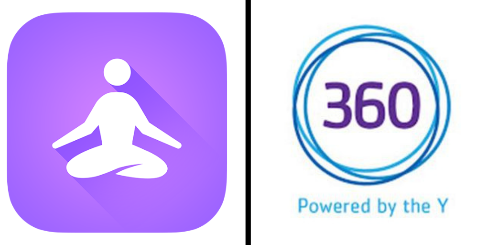
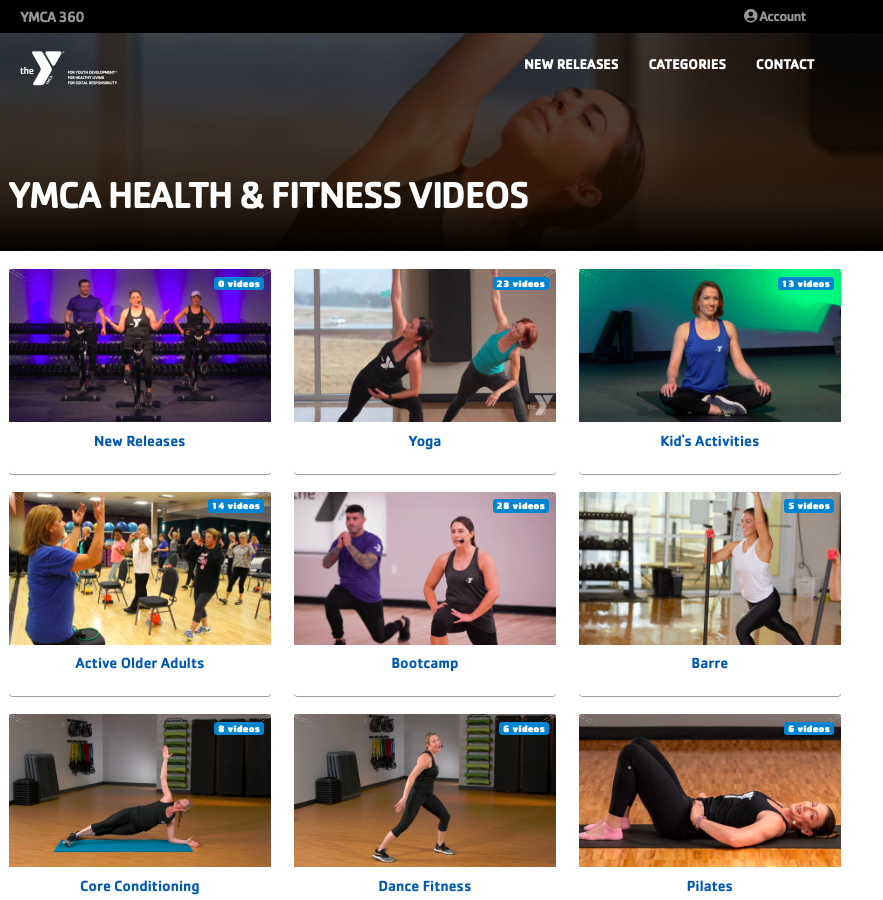
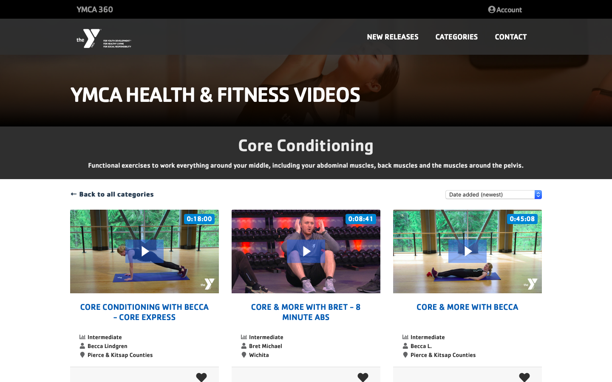
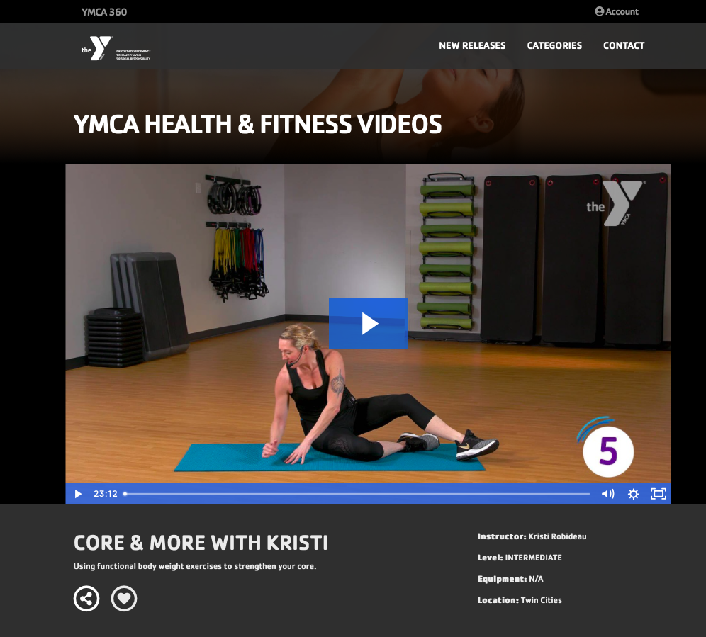
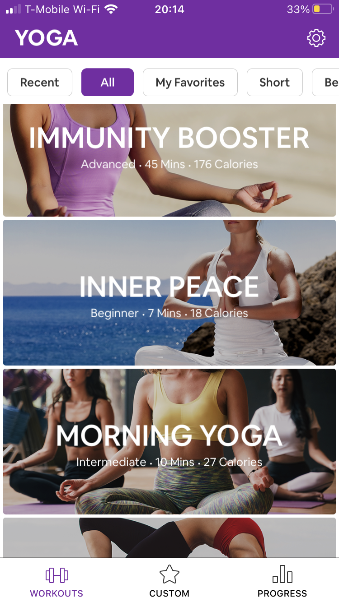
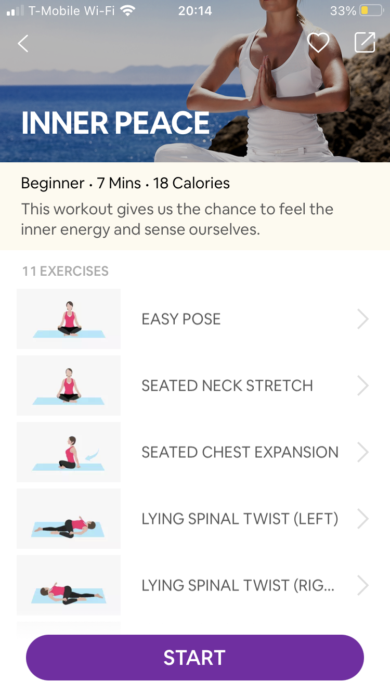
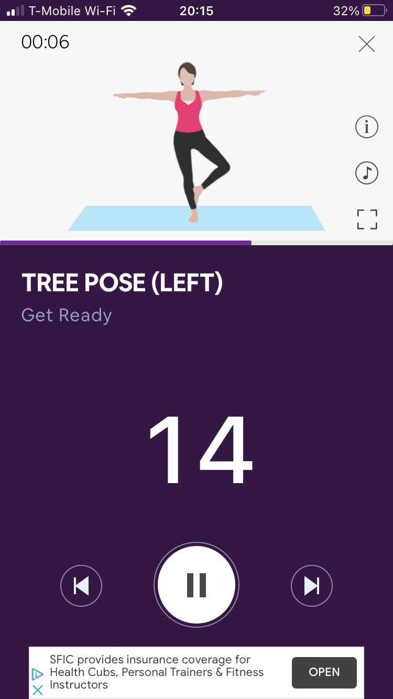
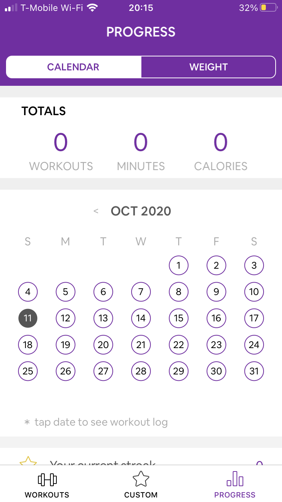

# Competitive Analysis & Heuristic Evaluation

## Competitors Choosen for the Evaluation: 

The first step of the project was to look at websites focused on the same subject as this project,fitness, and see how they pass the Nielson's 10 Heuristic evaluation. Because of my topic and my audience, I choose to evaluate the website of the YMCA for online exercise classes, [YMCA 360](https://ymca360.org/on-demand), that sources videos from their gyms across the country and tries to meet the needs of all age groups. I also choose the app, [Yoga For Beginners](https://apps.apple.com/us/app/yoga-for-beginners-mind-body/id1382141225), that offers free yoga courses as well as detailed explanations of each pose. 

I choose these two as one is a website and one is an app so I can compare the differences in how each work and the pros and cons. As well, both are targeted for all age groups with levels of intensity that differ, which would allow middle-age women to find a choose a course that fit their needs. 

### YMCA 360
The YMCA 360 is an app that was put in place during COVID-19 by the YMCA gyms around the U.S. to allow users of their gyms to still get the workout classes at all times at home. On top of the online free pre-recorded classes which I focus my evaluation on, you could also get live small group and one on one coaching all virtual as well. 

|             |**YMCA 360 - Home Page**     |
|---------------------------------------------------|-----------------------------|
|     |**YMCA 360 - Category Page** |
||**YMCA 360 - Page for Core Conditionning Exercises only**|
|                |**YMCA 360 - Workout Video** |

### Yoga for Beginners

|Yoga for Beginners- Home Page|Yoga for Beginners - Page that recaps all the poses that the users will do during that session|Yoga for Beginners - Workout Video|Yoga for Beginners - Calendar to keep track of the sessions users do|
|--------------------------------------|--------------------------------------|--------------------------------------|--------------------------------------|
|||||

## Heuristic Evaluation:

### 1. Visibility of system status
#### YMCA 360
> sghfjdg
#### Yoga For Beginners
> sghfjdg

### 2. Match between system and real world
#### YMCA 360
> sghfjdg
#### Yoga For Beginners
> sghfjdg

### 3. User control and freedom
#### YMCA 360
> sghfjdg
#### Yoga For Beginners
> sghfjdg

### 4. Consistency and standards
#### YMCA 360
> sghfjdg
#### Yoga For Beginners
> sghfjdg

### 5. Error prevention
#### YMCA 360
> sghfjdg
#### App 2
> sghfjdg

### 6. Recognition rather than recall
#### YMCA 360
> sghfjdg
#### Yoga For Beginners
> sghfjdg

### 7. Flexibility and efficiency of use
#### YMCA 360
> sghfjdg
#### Yoga For Beginners
> sghfjdg

### 8. Aesthetic and minimalist design
#### YMCA 360
> sghfjdg
#### Yoga For Beginners
> sghfjdg

### 9. Help users recognize, diagnose, and recover from errors
#### YMCA 360
> sghfjdg
#### Yoga For Beginners
> sghfjdg

### 10. Help and documentation
#### YMCA 360
> sghfjdg
#### Yoga For Beginners
> sghfjdg

## Recap of Severity Ratings of Both Apps:

#### YMCA 360
|1. Visibility |2. Match  |3. User Control|4. Consistency|5. Error prevention|
|--------------|----------|---------------|--------------|-------------------|
|number        |number    |number         |number        |number             |

|6. Recognition |7. Flexibility|8. Aesthetic |9. Recover errors|10. Documentation|
|---------------|--------------|-------------|-----------------|-----------------|
|number         |number        |number       |number           |number           |

#### Yoga For Beginners
|1. Visibility |2. Match  |3. User Control|4. Consistency|5. Error prevention|
|--------------|----------|---------------|--------------|-------------------|
|number        |number    |number         |number        |number             |

|6. Recognition |7. Flexibility|8. Aesthetic |9. Recover errors|10. Documentation|
|---------------|--------------|-------------|-----------------|-----------------|
|number         |number        |number       |number           |number           |

## Overall Evaluation and Comments:

