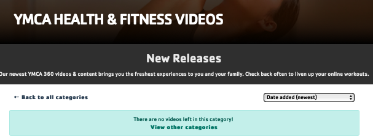

# Competitive Analysis & Heuristic Evaluation

## Competitors Choosen for the Evaluation: 

The first step of the project was to look at websites focused on the same subject as this project,fitness, and see how they pass the Nielson's 10 Heuristic evaluation. Because of my topic and my audience, I choose to evaluate the website of the YMCA for online exercise classes, [YMCA 360](https://ymca360.org/on-demand), that sources videos from their gyms across the country and tries to meet the needs of all age groups. I also choose the app, [Yoga For Beginners](https://apps.apple.com/us/app/yoga-for-beginners-mind-body/id1382141225), that offers free yoga courses as well as detailed explanations of each pose. 

I choose these two as one is a website and one is an app so I can compare the differences in how each work and the pros and cons. As well, both are targeted for all age groups with levels of intensity that differ, which would allow middle-age women to find and choose a course that fit their needs. 

### YMCA 360
The YMCA 360 is an app that was put in place during COVID-19 by the YMCA gyms around the U.S. to allow users of their gyms to still get the workout classes at all times at home. On top of the online free pre-recorded classes which I focus my evaluation on, you could also get live small group and one on one coaching all virtual as well. 

I started my overall evaluation by going through the easiest task of all and the one most of their users must do : find a workout video and play it. I first started on the ***home page***. This page was easy to navigate and overall minimalistics with high quality images. I quickly found the button to click on to see their videos and landed on the ***category page***. I then clicked on one of the boxes that was clearly labeled and landed on a ***product page*** with all the videos for core conditioning which was the type of workout I was looking for. I was then able to pick knowing the length of the workout video, the intensity and the instructor. I then clicked on the one I wanted and finally landed on the ***work-out video***. I then got to play it and put it full screen to follow along the workout. 

|YMCA 360 - Home Page                                          |YMCA 360 - Category Page                                      |
|--------------------------------------------------------------|--------------------------------------------------------------|
|                        |                |
|**YMCA 360 - Page for Core Conditionning Exercises only**     |**YMCA 360 - Workout Video**                                  |
|          |                           |

My overall first impression was that it was a clean interface but lacked easy ways to access videos I wanted right away. I had to go through 3 other pages before getting to this video and could not put it for example in my favorites for next time. I also felt that while it was very simple to navigate through it was hard to find some options (e.g. to get a page with all the videos and filter them you had to click on *home ---> categories* and then scrool down and click *all videos* to end up on that page. While at first, I thought the website looked amazingly done, I realize that the behind the well thoughtout aesthetic there was some flaws with the ease of use and of finding what is needed quickly. 

### Yoga for Beginners

|Yoga for Beginners- Home Page|Yoga for Beginners - Page that recaps the session|Yoga for Beginners - Workout Video|Yoga for Beginners - Calendar to keep track all the sessions users do|
|--------------------------------------|--------------------------------------|--------------------------------------|--------------------------------------|
|||||

## Heuristic Evaluation:

### 1. Visibility of system status
#### YMCA 360 (2) 
> The YMCA 360 had not an optimal visibility of system status. While it responded correctly and almost instantaneously to every command performed, it did not update the users on what is going on. A perfect example is that the biggest button on the home page is ***new releases*** which gives a feedback to the user to go check out new videos that have just came out. However, once you click it, you finally get an update from YMCA saying that, *There are no videos left in this category!*. However, it is too late of a feedback as the user has already had to click on the first button to get to their page. 
The YMCA 360 does however, when lagging on some feedback when it is loading a page as it has a round icon spinning to show it is processing the request. While the overall the visibility of system status. of the site is correct, it could be more performant and transparent to the users about current updates in content. 

#### Yoga For Beginners
> sghfjdg

### 2. Match between system and real world
#### YMCA 360 (2) 
> For the most part, the YMCA 360 site does a good job at matching the system with the real world. It uses icons like the play button, heart button, social media icons, that are knows by most. It also uses a simple scroll and click interface making using it effortless. 
The only downside is they use a lot of complex fitness jargon such as *bootcamp, core conditioning, Y box* which your average user might not know what to expect from. They should avoid using those words ad possibly also allow filters to have more options such as *ab workout, leg exercises* that are easier words the user might want to use to explain their needs and find the workout they had in mind. 

#### Yoga For Beginners
> sghfjdg

### 3. User control and freedom 
#### YMCA 360 (1) 
> The YMCA 360 site needs to work a lot more on user control and freedom as you cannot simply exii pages and videos from their site. The only way is through go back a page arrows on your web browser. Additionally, on the videos themselves, you cannot fast foward or go back a couple steps easily. While on a computer it might be easier because you can click on the timeline and drag the cursor back, on the tablet or smartphone with fingers, the website is not as receptive. Hence the user freedom feels very limited and the site is not thought out for it. 

#### Yoga For Beginners
> sghfjdg

### 4. Consistency and standards
#### YMCA 360
> sghfjdg
#### Yoga For Beginners
> sghfjdg

### 5. Error prevention
#### YMCA 360
> sghfjdg
#### App 2
> sghfjdg

### 6. Recognition rather than recall
#### YMCA 360
> sghfjdg
#### Yoga For Beginners
> sghfjdg

### 7. Flexibility and efficiency of use
#### YMCA 360
> sghfjdg
#### Yoga For Beginners
> sghfjdg

### 8. Aesthetic and minimalist design
#### YMCA 360
> sghfjdg
#### Yoga For Beginners
> sghfjdg

### 9. Help users recognize, diagnose, and recover from errors
#### YMCA 360
> sghfjdg
#### Yoga For Beginners
> sghfjdg

### 10. Help and documentation
#### YMCA 360
> sghfjdg
#### Yoga For Beginners
> sghfjdg

## Recap of Severity Ratings of Both Apps:

#### YMCA 360
|1. Visibility |2. Match  |3. User Control|4. Consistency|5. Error prevention|
|--------------|----------|---------------|--------------|-------------------|
|number        |number    |number         |number        |number             |

|6. Recognition |7. Flexibility|8. Aesthetic |9. Recover errors|10. Documentation|
|---------------|--------------|-------------|-----------------|-----------------|
|number         |number        |number       |number           |number           |

#### Yoga For Beginners
|1. Visibility |2. Match  |3. User Control|4. Consistency|5. Error prevention|
|--------------|----------|---------------|--------------|-------------------|
|number        |number    |number         |number        |number             |

|6. Recognition |7. Flexibility|8. Aesthetic |9. Recover errors|10. Documentation|
|---------------|--------------|-------------|-----------------|-----------------|
|number         |number        |number       |number           |number           |

## Overall Evaluation and Comments:

