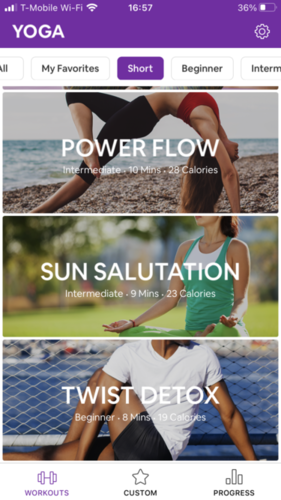

# Competitive Analysis & Heuristic Evaluation

## Competitors Choosen for the Evaluation: 

The first step of the project was to look at websites focused on the same subject as this project,fitness, and see how they pass the Nielson's 10 Heuristic evaluation. Because of my topic and my audience, I choose to evaluate the website of the YMCA for online exercise classes, [YMCA 360](https://ymca360.org/on-demand), that sources videos from their gyms across the country and tries to meet the needs of all age groups. I also choose the app, [Yoga For Beginners](https://apps.apple.com/us/app/yoga-for-beginners-mind-body/id1382141225), that offers free yoga courses as well as detailed explanations of each pose. 

I choose these two as one is a website and one is an app so I can compare the differences in how each work and the pros and cons. As well, both are targeted for all age groups with levels of intensity that differ, which would allow middle-age women to find and choose a course that fit their needs. 

### YMCA 360
The YMCA 360 is an app that was put in place during COVID-19 by the YMCA gyms around the U.S. to allow users of their gyms to still get the workout classes at all times at home. On top of the online free pre-recorded classes which I focus my evaluation on, you could also get live small group and one on one coaching all virtual as well. 

I started my overall evaluation by going through the easiest task of all and the one most of their users must do : find a workout video and play it. I first started on the ***home page***. This page was easy to navigate and overall minimalistics with high quality images. I quickly found the button to click on to see their videos and landed on the ***category page***. I then clicked on one of the boxes that was clearly labeled and landed on a ***product page*** with all the videos for core conditioning which was the type of workout I was looking for. I was then able to pick knowing the length of the workout video, the intensity and the instructor. I then clicked on the one I wanted and finally landed on the ***work-out video***. I then got to play it and put it full screen to follow along the workout. 

|YMCA 360 - Home Page                                          |YMCA 360 - Category Page                                      |
|--------------------------------------------------------------|--------------------------------------------------------------|
|                        |                |
|**YMCA 360 - Page for Core Conditionning Exercises only**     |**YMCA 360 - Workout Video**                                  |
|          |                           |

My overall first impression was that it was a clean interface but lacked easy ways to access videos I wanted right away. I had to go through 3 other pages before getting to this video and could not put it for example in my favorites for next time. I also felt that while it was very simple to navigate through it was hard to find some options (e.g. to get a page with all the videos and filter them you had to click on *home ---> categories* and then scrool down and click *all videos* to end up on that page. While at first, I thought the website looked amazingly done, I realize that the behind the well thoughtout aesthetic there was some flaws with the ease of use and of finding what is needed quickly. 

### Yoga for Beginners

|Yoga for Beginners- Home Page|Yoga for Beginners - Page that recaps the session|Yoga for Beginners - Workout Video|Yoga for Beginners - Calendar to keep track all the sessions users do|
|--------------------------------------|--------------------------------------|--------------------------------------|--------------------------------------|
|||||

## Heuristic Evaluation:

### 1. Visibility of system status
The ability of a system to be transparent about its status to users by giving them feedback as quickly as possible.

#### YMCA 360 (2) 
> The YMCA 360 had not an optimal visibility of system status. While it responded correctly and almost instantaneously to every command performed, it did not update the users on what is going on. A perfect example is that the biggest button on the home page is ***new releases*** which gives a feedback to the user to go check out new videos that have just came out. However, once you click it, you finally get an update from YMCA saying that, *There are no videos left in this category!*. However, it is too late of a feedback as the user has already had to click on the first button to get to their page. 
The YMCA 360 does however, when lagging on some feedback when it is loading a page as it has a round icon spinning to show it is processing the request. While the overall the visibility of system status. of the site is correct, it could be more performant and transparent to the users about current updates in content. 

###### This image shows how when you click on new releases on the front page it leads you to an empty page

#### Yoga For Beginners (1) 
> The Yoga app has a lot more transparency on the system status. It shows when things are loading and almost instantaneously responds to every command. The only downside is that it does not offer the opportunity to see the most recently created workouts like the YMCA and this would make the users aware that the system is constantly being updated and taken care of. 

###### This image shows that the app send a status update to the user. In this case, that it is processing their request

### 2. Match between system and real world
The system is able to present the content in a way that matches how users would perceive the information in their everyday life rather than how the system perceives the same content. 

#### YMCA 360 (2) 
> For the most part, the YMCA 360 site does a good job at matching the system with the real world. It uses icons like the play button, heart button, social media icons, that are knows by most. It also uses a simple scroll and click interface making using it effortless. 
The only downside is they use a lot of complex fitness jargon such as *bootcamp, core conditioning, Y box* which your average user might not know what to expect from. They should avoid using those words ad possibly also allow filters to have more options such as *ab workout, leg exercises* that are easier words the user might want to use to explain their needs and find the workout they had in mind. 

###### This image highlights the complex jargon used by the website

#### Yoga For Beginners (2) 
>  Similarly to the YMCA 360 site, the Yoga App does a good job matching the system with the real world. It used symboles like play, heart and arrows to signal users what to do. It also follows the standards for apps of the scrool and bottom bar with options to change from a page to another and a settings icon on the top right corner. However, similar to the YMCA 360, it uses a lot of jargon in its workout titles making it impossible for users to know if that is the workout that will fit their needs. 

###### This image highlights the complex jargon used by the app

### 3. User control and freedom 
Users have the ability to make a mistake and fix it as well as have the freedom to  leave immediately the current page or content at any point. 

#### YMCA 360 (3) 
> The YMCA 360 site needs to work a lot more on user control and freedom as you cannot simply exit pages and videos from their site. The only way is through go back a page arrows on your web browser. Additionally, on the videos themselves, you cannot fast foward or go back a couple steps easily. While on a computer it might be easier because you can click on the timeline and drag the cursor back, on the tablet or smartphone with fingers, the website is not as receptive. Hence the user freedom feels very limited and the site is not thought out for it. 

###### This image shows how on the video pages there is no way to go back

#### Yoga For Beginners (2) 
> On the Yoga app, the user has a lot of freedom and control over his or her actions. For instance, you can stop a video at anytime and there are undo button at every part of the process. The only place that lacks control is when the user create a customize workout as when they  add  a pose to the workout, they cannot take it out till way later steps. Also when you are on the workout page and you exit to take a call for instance, the app keeps playing the video in addition to the sound. I think both of these could be solved in order to create more freedom and control for the user. 

###### This image shows the workout video set up. When you exit the app while being on this page the exercises continue running

### 4. Consistency and standards
The use of icons, words and actions that are consistant within the website and with the standards of most online sites to not confuse the user or make them feel as if it is ambiguous. 

#### YMCA 360 (1) 
> The YMCA 360 website is constistent within itself and with the standards for these types of website. The only small difference they have is how they right the time on each video. On most platforms, they will simply put how many minutes or hour. In this case, each video has the same template which is *h:mm:ss*, which is very strange and feels unnatural compared to regular website as a 2 minute video is writen out with a lot of zero such as *0:02:03*. 

###### This image highlights how the way time is presented is unusual for a fitness website

#### Yoga For Beginners
> The overall application has consistancy within itself and with standards from apps similar to this one. Hence,the user does not get confused with any part of the platform. The only confusing part is that to decide how many circuts of one workout you will do, you have to change it in settings and go change it back everytime you want to do different amounts of circus across all workouts. This might be unusual to the users that might get confused about how to add circuits only for one workout on one specific day. I'd recommend asking users before every workout the amount of circuits they want to do. 

###### This image shows that to choose the amount of circuits you need to change it for all workouts at once in your setting. 

### 5. Error prevention
The ability to predict potential user errors and warn them against it before they even commit the error. 

#### YMCA 360 (1) 
> The YMCA 360 site leave little room for error in contrast to other sites as has no search bar (so you can't mess up typing) and most are clickable links that have always the right video behind them. The only except is the current *new release* page that has no video on it and the site gives you no warning about that. 
It does also prevent you from making mistakes when signing in as it lets you know if you got the password wrong for example. 

|||
|------------------------------------------|------------------------------------------|
###### These images highlightshow how you can click on the new release button on the home page and then land of an page with no content

#### Yoga For Beginners (1)
> The Yoga app does quite a good job are preventing errors. For instance before starting a video they make sure you meant to start that workout by having a notification making assert that you want to start that particular workout. Additionally there is an exit button on the workout video and if the user presses it, the app asks again if they are sure they want to leave before its done, in case they pressed it by accident. The minor problem is in the customize workout page, when you click on a position to add to the workout you can then not take it out till way later steps in the process and it does not prevent you by clicking by accident on a pose you did not want to add. 

|||
|------------------------------------------|------------------------------------------|
###### These images highlightshow the app sends you a notification to make sure you are or are not willing to start or stop the video

### 6. Recognition rather than recall
Allowing users to not have to memorize actions or information by making all the possibilities clear and visible to them at all time to allow users to reach their goals easily. 

#### YMCA 360 (3) 
> The YMCA site fails to offer recognition opportunities to its users. For example, even when logged into an account, the YMCA does not let you see your search history on the website (for instance the last 3 videos workouts you did). While it does offer favorites when logged in, it doesnt have a button on the top bar to access them easily and remind you that you have favored some videos. Hence your favorites are very hard to access as they are not also for example in a *favorite category* on the *category page*. 

###### This image highlights that there is no favorite tab on the navigation bar or opportunity to search a video easily

#### Yoga For Beginners (3)
> There is very little recognition as most of the videos have not names that are links to the needs that they fulfill and does not help with recognition. Additionally, in the create your own workout there is no recognition processes that makes a user sure of what the pose does and how it can help. The only positive recognition principle it utilizes is having a recent tab and a favorite tab on the home page. 

###### This image shows that there is no recognition in the needs of the user on the option to customize a workout 

### 7. Flexibility and efficiency of use
Allowing users the choose of how to perform their actions through different routes depending on their level of expertise using said site and allowing users more familar with it to use shortcut to perform actions more efficently. 

#### YMCA 360 (3) 
> The YMCA 360 site in itself has very little flexibily nd efficiency of use as it does not allow for shortcuts on the first page to for instance get to the videos for pilates. Everytime you want a workout video you need to follow the same long journey *home --> category ---> page for that type of exercise --> video page*. It has also no search bar for people to save time and type the exact video they want. 

> The only place the site has some flexibility and efficiency of use is on the videos themselves. Users can play and stop the video by clicking the the button with the play symbol in the bottom left corner or just by clicking their space bar. They can also go back and forth on the videos with the arrow on the keyboard but this is an inflexible shortcut as people on tablets and smartphones cannot use that command. 

###### This image highlights the lack of a shortcut to speed of the video or to rewind a couple of secounds

#### Yoga For Beginners (3) 
> The app in contrast to the YMCA 360 website has some short cuts as it has a tab for both workouts user have favored and recent ones they have done. Also it has some filters of intensity but I think it could go further by offering filter based on needs for the activity (muscle pain, target area, relaxation, energy boosting etc). 

> The most critical part of its inflexibility however is the fact that when you are on a workout video you do not get a detailed explanation of how to do well the pose. To get said information you need to click on the information button clearly marked which stops the video and brings you to another page where you have to start a new video to explain how to do the pose. This inefficiency in how you can see the pose is an issue as it forces ppl to stop exercising and maybe give up on the rest of the workout. Also it leaves room for the other video which is on YouTube to have to take time to load making it an uncomfortable experience for the user.

|||
|------------------------------------------|------------------------------------------|
###### These images show how when you are on the exercise it forces you to exit the video to see how to do the pose well

### 8. Aesthetic and minimalist design
This heuristic focuses on the design aspect of the site and if it allows the user to navigate easily through the content without clutter or irrelevant information.

#### YMCA 360 (1)
> The overall aesthetic of the website is perfect as it does not over power the usability aspect of it and makes you want to click. The color and font scheme work well together and the images are in high definition. The only problem is the fact that the descriptions for the videos about the instructor, level of intensity etc. are in small font but are bolded which makes it hard sometimes for reader to read it, especially older users. 

###### This image shows how hard it can be to read the description due to the bolded text

#### Yoga For Beginners (2) 
> Similar to the YMCA 360 website, the overall aesthetics of the app is very easy to comprehend and minimalistic while still looking pleasing to the eye with a consistant color and font scheme as well as high resolution images. However, it did have some clutter making it non minimalistic and hard to navigate on the *create your workout* page. I would recommend they clear it up by ordering all the poses in to possible subsections you could open and close and that would show what poses help meet the needs the user may have (back, neck, etc.). 

###### This image shows how little clearity there is in the option to customize a workout

### 9. Help users recognize, diagnose, and recover from errors
The ability to help users understand the problem and why they cannot complete their goals in simple form and then offer them a solution to solving it. 

#### YMCA 360 (2) 
> Most of the YCMA 360 site leaves little space for errors in the first place however in the places with possible errors it does give instructions on where the error is. For instance in log in area, when you input the information wrong it sends a red message with instructions on how to fix it and in the new releases page with no videos it has a sign with an explamation point to highlight there is no videos and is the only page that has the ability on the page to go back to see the categories.

> While it is good at recognizing and diagonsing the errors and infroming users on how to correct them, it does not actually allow them sometimes to go back and fix these errors without having to click on the arrows offered by your web browser.

>However, the site does have a great and easy to use contact form which you can use even if you dont have an account. 

###### This image shows the contact form page

#### Yoga For Beginners (3)
> One of the biggest issue with the website is the lack of ability to help users in times of struggle. It at no point helps you recognize when there is an error or diagnose one for you and hence cannot recover from it. The best example is that after completing the task of viewing how to do a pose (heuristic 7), I went back on the workout vid and the positions in the workout video weren’t there even if the workout was playing. When that happen there was no sign there was an error and no area on that page to signal the error. This needs to be fix so the app can be made aware of errors and also overall the app needs to be more conscious of recognizing and diagnosing errors. 

###### This images highlights a glitch in the system with not diagnosis or way to recover explained to the user

### 10. Help and documentation
Allowing the user when confused or lost to easily find answers to their question with clear documentation. 

#### YMCA 360 (2)
> The YMCA 360 site has a FAQ page which is extensive and very useful however, it can be hard to users to find. You see it appear on the home page and in small font on the contact page nut when on other pages, the only way to access it is to scroll all the way to the bottom and see it hidden in small in between a lot of link to pages you would never use. Hence it is not something logic to find for the user and inefficent. I recommend making it more easy to find at all times. 

###### This image highlights the fact that on a video page you cannot see the FAQ button at any point

#### Yoga For Beginners (3) 
> The biggest issue with this site is the lack of help when trying to solve a problem as seen with the heuristic above. Help and documentation is no different as the site has currently no FAQs to help them with any questions  they may have. It does however has a contact form that is a simple button that leads to an email address. I would recommend they add an FAQ. 

###### This image shows that there is no FAQ but there is a contact form if need be

## Recap of Severity Ratings of Both Apps:
Severity Ratings is a way for UX designers to assess the severity of heuristic violation and then prioritize which ones to spend the most ressources on to solve as they are the most blocking to a seamless user experience. In this case I ranked them from a scale of 1 to 3 with 1 being only cosmetic issues or low priority violations, 2 being important violations, 3 being the most urging to solve violations (top priority). 

### YMCA 360
|1. Visibility |2. Match  |3. User Control|4. Consistency|5. Error prevention|
|--------------|----------|---------------|--------------|-------------------|
|2             |2         |3              |1             |1                  |

|6. Recognition |7. Flexibility|8. Aesthetic |9. Recover errors|10. Documentation|
|---------------|--------------|-------------|-----------------|-----------------|
|3              |3             |1            |2                |2                |

### Recommended Changes for YMCA 360 Based on Priority
#### Top Priority:
* **User Control:** The biggest issue with user control is the lack of possibilies to go back pages within the website. I recommend they add more buttons to easily exist for instance workout video pages. These are crucial to making the experience seamless
* **Recognition:** The website has no shortcuts and no ability to efficently recognize to videos you previously used to workout or your favorite. I would recommend adding a search bar on the home screen for those who know what video they want to see as well as in the navigation bar for those logged in a Favorites tab to go directly to the videos they link. 
* **Flexibility:** Especially on the videos there is little possibilies to rewind or move foward easily especially on tablet. I recommend they modify this to allow their users to move at their own pace and see the instructor do the move again if need be. Also to ameliorate flexibility on the website the recommendation for recognition is also good.  
#### Important to fix: 
* *Visibility:* In some case, the website fails to be transparent with the users about its ability to be receptive to their commands especially when it comes to pages that are then blank. I recommend they update their website to only show for instance the new releases tab when they actually have new videos. 
* *Match:* In the matching the system with reality heuristic, the website fails to use easy and everyday words and instead uses more techincal phrases such as conditioning and and bootcamp. They can change this by using more descriptions such as if they want to keep the category as bootcamp say **bootcamp (abs, legs, butts, full-body etc.)*** so typical users also recognise their needs in a way they can understand it. 
* *Recover errors:* While there is clear signs to recognize and diagnose the errors, the website often times does not allow undoing the mistake, for example, clicking on the wrong video. I would recommend they put more reverse buttons on the website and allow users to exit video pages more easily. 
* *Documentation:* The biggest problem with the documentation is not the inexistance of one but more the difficulty to finding it. I would recommend that their add it to the navigation bar to make it easy to reach at all time. 
#### Cosmetic Changes/Low Priority:
* *Consistency:* The only part that stands out is the weird way they formated the time per video. I would recommend simplying it by taking out the seconds or just having hours included when it is over an hour long. 
* *Error Prevention:* The small issue with this one is the new release button front and center on the home page that leads to no new video. I would simply remove it and just have a button to all videos when there is no new one. 
* *Aesthetic:* The small issue is the video descriptions are in a font that when bold and small size is hard to read. I would either increase font size or unbold it. 

### Yoga For Beginners
|1. Visibility |2. Match  |3. User Control|4. Consistency|5. Error prevention|
|--------------|----------|---------------|--------------|-------------------|
|1             |2         |2              |1             |1                  |

|6. Recognition |7. Flexibility|8. Aesthetic |9. Recover errors|10. Documentation|
|---------------|--------------|-------------|-----------------|-----------------|
|3              |3             |2            |3                |3                |

#### Recommended Changes Based on Priority
##### Top Priority:
* **Recognition:**  The problem here is that most of the videos do not  have names that are links to the needs that they fulfill and does not help with recognition. Additionally, in the create your own workout, there is no recognition process that makes a user sure of what the pose does and how it can help them during the workout. I recommend creating titles that lead to more recognition though processes as well as compiling poses based on their benefits to the user and not their names to create recognition. 
* **Flexibility:** The biggest problem with the inflexibility of this app is that when on a workout video, users do not get a detailed explanation of how to do well the pose. To get said information  the user must click on the information button which stops the video and brings them to another page where they can start a new video to explain how to do the pose. This inefficiency leads to an uncomfortable experience for the user. I recommend at least having an explanation option in text/ voice over of the pose on the workout video so that user does not have to stop the video to figure out how to do the pose correctly.  
* **Recover Errors:** One of the biggest issue with the website is the lack of ability to help users in times of struggle. It at no point helps you recognize when there is an error or diagnose one for you and hence cannot recover from it. This needs to be fix so the app can be made aware of errors and also overall the app needs to be more conscious of recognizing and diagnosing errors. 
* **Documentation:** The biggest issue with this site is the lack of help when trying to solve a problem as seen with the heuristic above. Help and documentation is no different as the site has currently no FAQs to help them with any questions  they may have. It does however has a contact form that is a simple button that leads to an email address. I would recommend they add an FAQ. 
##### Important to fix: 
* *Match:* The problem with this app is the use of a lot of jargon in its workout titles making it impossible for users to know if that is the workout that will fit their needs. I would recommend they make more descriptive titles focus on the needs it helps the user solve rather than yoga jargon. 
* *User Control:* The only place that lacks control is when the user create a customize workout as when they  add  a pose to the workout, they cannot take it out till way later steps. I think this can be resolved by creating delete buttons also on that page creating more freedom and control for the user. 
* *Aesthetic:* The problem with this app’s aesthetic is  that it has some clutter on the create your workout page. I would recommend they clear it up by ordering all the poses in to possible subsections you could open and close and that would show what poses help meet the needs the user may have (back, neck, etc.). 
#### Cosmetic Changes/Low Priority:
* *Visibility:* The only downside is that it does not offer the opportunity to see the most recently created workouts like the YMCA and this would make the users aware that the system is constantly being updated and taken care of. I would recommend just having a recently added video section to show that their is continuous update on the platform. 
* *Consistency:* . The confusing part is that to decide how many circuts of one workout you will do, you have to change it in settings and go change it back everytime you want to do different amounts of circus across all workouts. I'd recommend asking users before every workout the amount of circuits they want to do. 
* *Error prevention:* The Yoga app does quite a good job are preventing errors. The minor problem is in the customize workout page, when you click on a position to add to the workout you can then not take it out at that stage and it does not prevent you by clicking by accident on a pose you did not want to add. I would recommend they simple allow users to remove also workouts at that stage or double check each time the user is not making an error by adding it to the workout list. 

## Overall Evaluation and Comments:

