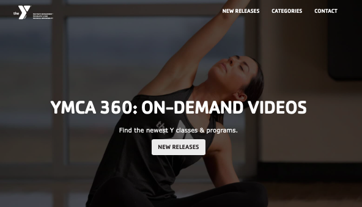

# Competitive Analysis & Heuristic Evaluation

## Competitors Choosen for the Evaluation: 

The first step of the project was to look at websites focused on the same subject as this project,fitness, and see how they pass the Nielson's 10 Heuristic evaluation. Because of my topic and my audience, I choose to evaluate the website of the YMCA for online exercise classes, [YMCA 360](https://ymca360.org/on-demand), that sources videos from their gyms across the country and tries to meet the needs of all age groups. I also choose the app, [Yoga For Beginners](https://apps.apple.com/us/app/yoga-for-beginners-mind-body/id1382141225), that offers free yoga courses as well as detailed explanations of each pose. 

I choose these two as one is a website and one is an app so I can compare the differences in how each work and the pros and cons. As well, both are targeted for all age groups with levels of intensity that differ, which would allow middle-age women to find and choose a course that fit their needs. 

### YMCA 360
The YMCA 360 is an app that was put in place during COVID-19 by the YMCA gyms around the U.S. to allow users of their gyms to still get the workout classes at all times at home. On top of the online free pre-recorded classes which I focus my evaluation on, you could also get live small group and one on one coaching all virtual as well. 

I started my overall evaluation by going through the easiest task of all and the one most of their users must do : find a workout video and play it. I first started on the ***home page***. This page was easy to navigate and overall minimalistics with high quality images. I quickly found the button to click on to see their videos and landed on the ***category page***. I then clicked on one of the boxes that was clearly labeled and landed on a ***product page*** with all the videos for core conditioning which was the type of workout I was looking for. I was then able to pick knowing the length of the workout video, the intensity and the instructor. I then clicked on the one I wanted and finally landed on the ***work-out video***. I then got to play it and put it full screen to follow along the workout. 

|YMCA 360 - Home Page                                          |YMCA 360 - Category Page                                      |
|--------------------------------------------------------------|--------------------------------------------------------------|
|                        |                |
|**YMCA 360 - Page for Core Conditionning Exercises only**     |**YMCA 360 - Workout Video**                                  |
|          |                           |

My overall first impression was that it was a clean interface but lacked easy ways to access videos I wanted right away. I had to go through 3 other pages before getting to this video and could not put it for example in my favorites for next time. I also felt that while it was very simple to navigate through it was hard to find some options (e.g. to get a page with all the videos and filter them you had to click on *home ---> categories* and then scrool down and click *all videos* to end up on that page. While at first, I thought the website looked amazingly done, I realize that the behind the well thoughtout aesthetic there was some flaws with the ease of use and of finding what is needed quickly. 

### Yoga for Beginners

|Yoga for Beginners- Home Page|Yoga for Beginners - Page that recaps the session|Yoga for Beginners - Workout Video|Yoga for Beginners - Calendar to keep track all the sessions users do|
|--------------------------------------|--------------------------------------|--------------------------------------|--------------------------------------|
|||||

## Heuristic Evaluation:

### 1. Visibility of system status
#### YMCA 360 (2) 
> The YMCA 360 had not an optimal visibility of system status. While it responded correctly and almost instantaneously to every command performed, it did not update the users on what is going on. A perfect example is that the biggest button on the home page is ***new releases*** which gives a feedback to the user to go check out new videos that have just came out. However, once you click it, you finally get an update from YMCA saying that, *There are no videos left in this category!*. However, it is too late of a feedback as the user has already had to click on the first button to get to their page. 
The YMCA 360 does however, when lagging on some feedback when it is loading a page as it has a round icon spinning to show it is processing the request. While the overall the visibility of system status. of the site is correct, it could be more performant and transparent to the users about current updates in content. 

###### This image shows how when you click on new releases on the front page it leads you to an empty page

#### Yoga For Beginners
> loads let you know it works

### 2. Match between system and real world
#### YMCA 360 (2) 
> For the most part, the YMCA 360 site does a good job at matching the system with the real world. It uses icons like the play button, heart button, social media icons, that are knows by most. It also uses a simple scroll and click interface making using it effortless. 
The only downside is they use a lot of complex fitness jargon such as *bootcamp, core conditioning, Y box* which your average user might not know what to expect from. They should avoid using those words ad possibly also allow filters to have more options such as *ab workout, leg exercises* that are easier words the user might want to use to explain their needs and find the workout they had in mind. 

###### This image highlights the complex jargon used by the website

#### Yoga For Beginners
>  a lot of industry jargon 

### 3. User control and freedom 
#### YMCA 360 (3) 
> The YMCA 360 site needs to work a lot more on user control and freedom as you cannot simply exit pages and videos from their site. The only way is through go back a page arrows on your web browser. Additionally, on the videos themselves, you cannot fast foward or go back a couple steps easily. While on a computer it might be easier because you can click on the timeline and drag the cursor back, on the tablet or smartphone with fingers, the website is not as receptive. Hence the user freedom feels very limited and the site is not thought out for it. 

###### This image shows how on the video pages there is no way to go back

#### Yoga For Beginners
> ability to exit and enter whenever does not stop immediately when you are off the app

### 4. Consistency and standards
#### YMCA 360 (1) 
> The YMCA 360 website is constistent within itself and with the standards for these types of website. The only small difference they have is how they right the time on each video. On most platforms, they will simply put how many minutes or hour. In this case, each video has the same template which is *h:mm:ss*, which is very strange and feels unnatural compared to regular website as a 2 minute video is writen out with a lot of zero such as *0:02:03*. 

###### This image highlights how the way time is presented is unusual for a fitness website

#### Yoga For Beginners
> consistent with standard (music 

### 5. Error prevention
#### YMCA 360 (1) 
> The YMCA 360 site leave little room for error in contrast to other sites as has no search bar (so you can't mess up typing) and most are clickable links that have always the right video behind them. The only except is the current *new release* page that has no video on it and the site gives you no warning about that. 
It does also prevent you from making mistakes when signing in as it lets you know if you got the password wrong for example. 

|||
|------------------------------------------|------------------------------------------|
###### These images highlightshow how you can click on the new release button on the home page and then land of an page with no content

#### Yoga For Beginners
> make sure you meant to start or stop workout

### 6. Recognition rather than recall
#### YMCA 360 (3) 
> The YMCA site fails to offer recognition opportunities to its users. For example, even when logged into an account, the YMCA does not let you see your search history on the website (for instance the last 3 videos workouts you did). While it does offer favorites when logged in, it doesnt have a button on the top bar to access them easily and remind you that you have favored some videos. Hence your favorites are very hard to access as they are not also for example in a *favorite category* on the *category page*. 

###### This image highlights that there is no favorite tab on the navigation bar or opportunity to search a video easily

#### Yoga For Beginners
> no ability to choose targeted posed for needs and when custom doesnt tell you what it helps with

### 7. Flexibility and efficiency of use
#### YMCA 360 (3) 
> The YMCA 360 site in itself has very little flexibily nd efficiency of use as it does not allow for shortcuts on the first page to for instance get to the videos for pilates. Everytime you want a workout video you need to follow the same long journey *home --> category ---> page for that type of exercise --> video page*. It has also no search bar for people to save time and type the exact video they want. 

> The only place the site has some flexibility and efficiency of use is on the videos themselves. Users can play and stop the video by clicking the the button with the play symbol in the bottom left corner or just by clicking their space bar. They can also go back and forth on the videos with the arrow on the keyboard but this is an inflexible shortcut as people on tablets and smartphones cannot use that command. 

###### This image highlights the lack of a shortcut to speed of the video or to rewind a couple of secounds

#### Yoga For Beginners
> has to stop video and turn on another one to understand how to do a pose

### 8. Aesthetic and minimalist design
#### YMCA 360 (1)
> The overall aesthetic of the website is perfect as it does not over power the usability aspect of it and makes you want to click. The color and font scheme work well together and the images are in high definition. The only problem is the fact that the descriptions for the videos about the instructor, level of intensity etc. are in small font but are bolded which makes it hard sometimes for reader to read it, especially older users. 

###### This image shows how hard it can be to read the description due to the bolded text

#### Yoga For Beginners
> good design but maybe over crowded in the customizable one (maybe subsections)

### 9. Help users recognize, diagnose, and recover from errors
#### YMCA 360 (2) 
> Most of the YCMA 360 site leaves little space for errors in the first place however in the places with possible errors it does give instructions on where the error is. For instance in log in area, when you input the information wrong it sends a red message with instructions on how to fix it and in the new releases page with no videos it has a sign with an explamation point to highlight there is no videos and is the only page that has the ability on the page to go back to see the categories.

> While it is good at recognizing and diagonsing the errors and infroming users on how to correct them, it does not actually allow them sometimes to go back and fix these errors without having to click on the arrows offered by your web browser.

>However, the site does have a great and easy to use contact form which you can use even if you dont have an account. 

###### This image shows the contact form page

#### Yoga For Beginners
> actually error and no warning or place to say why it doesnt work (video after i click for info)

### 10. Help and documentation
#### YMCA 360 (2)
> The YMCA 360 site has a FAQ page which is extensive and very useful however, it can be hard to users to find. You see it appear on the home page and in small font on the contact page nut when on other pages, the only way to access it is to scroll all the way to the bottom and see it hidden in small in between a lot of link to pages you would never use. Hence it is not something logic to find for the user and inefficent. I recommend making it more easy to find at all times. 

###### This image highlights the fact that on a video page you cannot see the FAQ button at any point

#### Yoga For Beginners
> no FAQ 

## Recap of Severity Ratings of Both Apps:

### YMCA 360
|1. Visibility |2. Match  |3. User Control|4. Consistency|5. Error prevention|
|--------------|----------|---------------|--------------|-------------------|
|2             |2         |3              |1             |1                  |

|6. Recognition |7. Flexibility|8. Aesthetic |9. Recover errors|10. Documentation|
|---------------|--------------|-------------|-----------------|-----------------|
|3              |3             |1            |2                |2                |

### Recommended Changes for YMCA 360 Based on Priority
#### Top Priority:
* **User Control:** The biggest issue with user control is the lack of possibilies to go back pages within the website. I recommend they add more buttons to easily exist for instance workout video pages. These are crucial to making the experience seamless
* **Recognition:** The website has no shortcuts and no ability to efficently recognize to videos you previously used to workout or your favorite. I would recommend adding a search bar on the home screen for those who know what video they want to see as well as in the navigation bar for those logged in a Favorites tab to go directly to the videos they link. 
* **Flexibility:** Especially on the videos there is little possibilies to rewind or move foward easily especially on tablet. I recommend they modify this to allow their users to move at their own pace and see the instructor do the move again if need be. Also to ameliorate flexibility on the website the recommendation for recognition is also good.  
#### Important to fix: 
* *Visibility:* In some case, the website fails to be transparent with the users about its ability to be receptive to their commands especially when it comes to pages that are then blank. I recommend they update their website to only show for instance the new releases tab when they actually have new videos. 
* *Match:* In the matching the system with reality heuristic, the website fails to use easy and everyday words and instead uses more techincal phrases such as conditioning and and bootcamp. They can change this by using more descriptions such as if they want to keep the category as bootcamp say **bootcamp (abs, legs, butts, full-body etc.)*** so typical users also recognise their needs in a way they can understand it. 
* *Recover errors:* While there is clear signs to recognize and diagnose the errors, the website often times does not allow undoing the mistake, for example, clicking on the wrong video. I would recommend they put more reverse buttons on the website and allow users to exit video pages more easily. 
* *Documentation:* The biggest problem with the documentation is not the inexistance of one but more the difficulty to finding it. I would recommend that their add it to the navigation bar to make it easy to reach at all time. 
#### Cosmetic Changes/Low Priority:
* *Consistency:* The only part that stands out is the weird way they formated the time per video. I would recommend simplying it by taking out the seconds or just having hours included when it is over an hour long. 
* *Error Prevention:* The small issue with this one is the new release button front and center on the home page that leads to no new video. I would simply remove it and just have a button to all videos when there is no new one. 
* *Aesthetic:* The small issue is the video descriptions are in a font that when bold and small size is hard to read. I would either increase font size or unbold it. 

### Yoga For Beginners
|1. Visibility |2. Match  |3. User Control|4. Consistency|5. Error prevention|
|--------------|----------|---------------|--------------|-------------------|
|number        |number    |number         |number        |number             |

|6. Recognition |7. Flexibility|8. Aesthetic |9. Recover errors|10. Documentation|
|---------------|--------------|-------------|-----------------|-----------------|
|number         |number        |number       |number           |number           |

#### Recommended Changes Based on Priority
##### Top Priority:
* **User Control:** 
* **User Control:** 
* **User Control:** 
##### Important to fix: 
* *User Control:*
* *User Control:* 
* *User Control:* 
* *User Control:* 

## Overall Evaluation and Comments:

