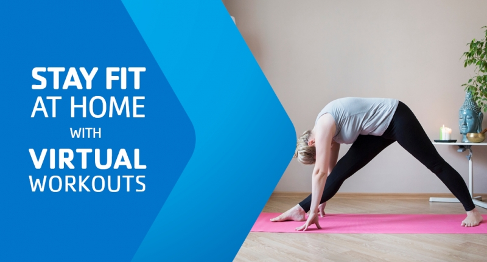

# Usability Testing 

## Introduction 

My goal with this UX projects is to create a website that is enticing and easy to us and encourages everyone but especially middle-age women to find the right exercise classes for their needs depending on multiple variables such as intensity, location, duration etc. Because of the age demographic, I found that the YMCA was my closest competitor as it focuses more on exercises for all ages than other gyms that focus more on young people craving high-intensity workouts. It launched a website, [YMCA 360](https://ymca360.org/), that offers free recording of classes for free to all online. 

After conducting a [heuristic evaluation](https://github.com/alixlb/DH150---Fall-2020/blob/main/assignment1/heuristicevaluation.md) on it, I realized multiple principles where being violated especially the help and documentation, user control and  freedom, and flexibility and efficiency of use. It was also hard sometimes to navigate through especially when trying to go back or find the favorite folder which is essential to the principle of recognition rather than recall. Hence I decided to look further into this website and see how my target audience reacts when testing the website. 

I started by a pilot Usability Test and focused on 3 main tasks: playing a workout video, finding the FAQ, and using the favoring video function. I thought the most important part of this test was using a middle-age woman as my subject to see how she would react to the site. My goal with this experiment was to see if my Usability Test material was effective and in term better understand the usability experience of target users to then use those finding on my website. 

## Methodology 

I will perform this pilot usability test in my quiet living room at home. I will use XYZ to record the participant screen and XYZ to record their expressions. My material is a MacBook Air. The pilot test is in order to test the setting and the UT materials. It should take  about XYZ minutes to do.  

I will be as well sitting next to them and taking notes as they go while being as unbiased of a moderator as can be. However, as my participant’s first language is not English, I may have at times have to intervene and translate the question to her from French. 

At the beginning of the test, I will explain the measures and rules of the usability testing to the participant. I will ask if I can record them and walk them through the steps of the test as follow:
* ***Background questions*** that are intended to see the participant possible history using this app.
* ***Pre-test questions*** that simple allow the participant to look at a screenshot of the website and judge the website on 4 criteria: straightforwardness, trustability, professionalism and how enticing it looks. At this point in the survey, the user is basing on the looks of the website
* ***Task 1*** revolves around being on the home page and making your way through the pages to play a workout video.
* ***Task 2*** involves going to the FAQ page and finding the answer to a question.
* ***Task 3*** involves logging in and then choosing to favor a video and then play it. 
* ***Post-test questions*** help get feedback about how the user perceive those tasks to be based on difficulty, relevancy and time spent.
* *** System Usability Scale*** judges how much the participant felt using the website based on a scale of strongly disagree to strongly agree about the ease of use, efficiency etc. of the website. 
* *** Product satisfaction cards** help both understand how the user perceives the website based on 5 adjectives to describe it.
* ***Demographic questions***: Questions about age, gender, ethnicity, primary language and how often they exercise.

 Overall, the goal of this test is to get a holistic view of how the user feels using the website and get a better understanding about how the target demographic uses sites for fitness in general. 

## User Testing Material
To do the Usability Testing, I used:
* Macbook Air
* (software for screen)
* (software for recording)
* [Google Form](https://forms.gle/uxLMg5HAhpXMSHAq8)

## Pilot Usability Testing

## Reflection 
