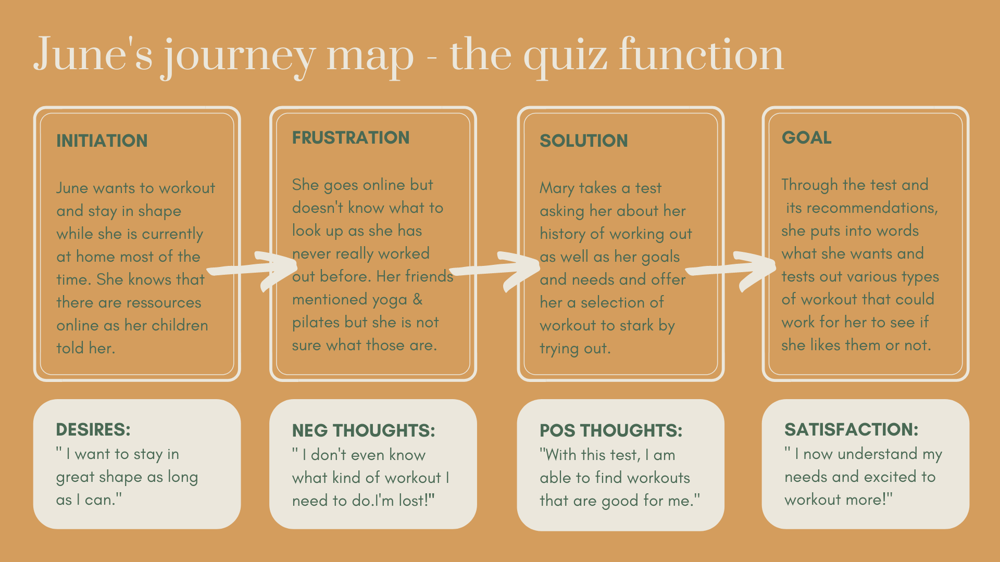
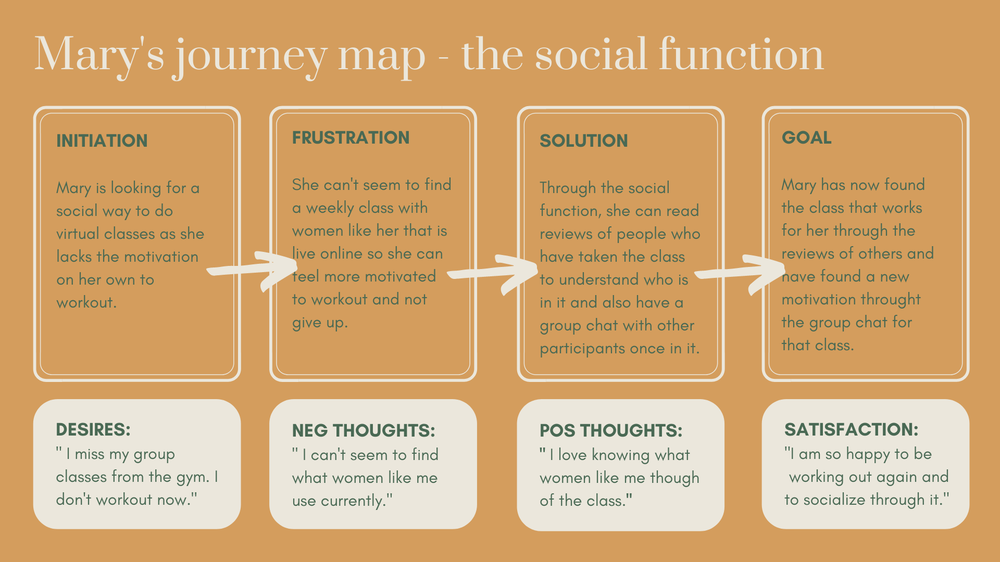
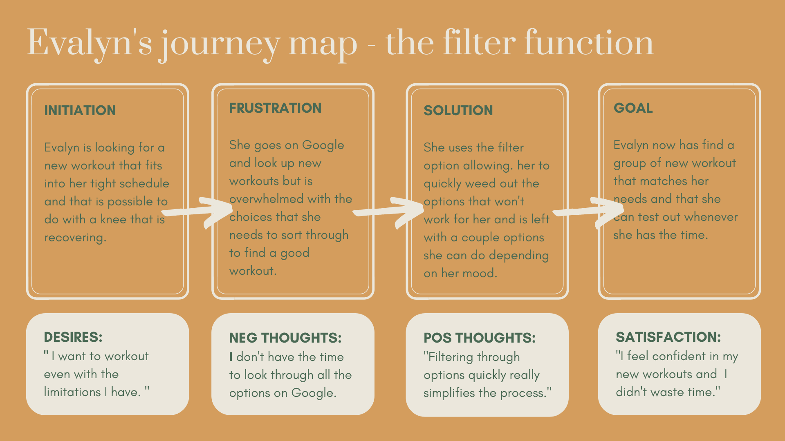

## Personas and Scenarios

### The Purpose of Storytelling

UX Storytelling reminds the researchers and designers that the experience must be user-centered. By think no longer websites based on heuristic principles and user interviews as data points, UX storytelling allows researcher to reflect on the underlying feeling and desires that users may have when completing the task and assuring that those are being satisfied by the results of the project. By creating personas, I will be able to think as the target users more generally and understand better how the current system in place does not meet their goals.

### Design Features 

Based on my previous research, I plan to implement 3 design features that I believe will help users feel incentive to workout and more confident in their choices of workout: 
* **Filters:** create an extensive possibility of filter options and categorize them easily based on needs that users may have when working out. This will allow them to  easily narrow down their choices from the thousands of options available to them on the internet. Some examples of those filters are: type of workout, level of intensity, lengths, targeted area of the body, equipment needed, type of workout (images, videos, prerecorded, live, in person, virtual), price, etc.
* **Social reviews:** the ability to have an account on the site and interact with other of the site members through chats and trusted reviews. Like the Sephora website, the reviews will give some description of who the reviewer is in order to see what people similar to you have said about the particular workout and help you see if it may fit your needs. It creates a more social component that currently cannot be recreated due to the social distancing. 
* **Quiz function:** to help beginners or people with recent changes in their capabilities (injuries, pregnancies etc.) understand what are their needs and offer them initial options to see which they like and do not like. 

### Persona & Empathy Map

#### June - the recent retiree

#### Mary - the social butterfly

#### Evalyn - the busy bee

### Scenarios & Journey Map

While all functions I plan to improve in my project can be used by each personal to reach their goals, I have prefered to create a scenario for each function that highighted how it could help one of the persona at least achieve her goals and meet her needs. 

#### 1. June's Scenario - the quiz function

> *This detail quiz feature will help beginners or people with recent changes in their capabilities (injuries, pregnancies etc.) understand what are their needs and offer them initial options to see which they like and dislike based on workouts that are perfect for them.*

June is now actively looking to start working out. She has asked some friends about what they like to do and they have all told her different answers ranging from yoga to running to Zumba. While June has heard of these different types of workout before, she has no clue which one she would like and what benefits each have for her body.

 Because of COVID-19, going to her local gyms and seeing what they offered was not a possibility so she turned to the internet and planned to workout from the comfort of her own home. However, she had no clue what to research and didn’t know what equipment she needed or how long she should clearly workout for. She was completely lost and felt like she didn’t know how to start. 

She then found Fitness for All and clicked on their quiz. Within the next 10 minutes, she was able to understand and put into words what she wanted, what she thinks she likes and dislikes as well as how equipped she is. She then created a profile that offered her various types of workouts that matched her criteria and allowed her to try it workout and create a feedback loop once complete. The more she tried out workouts given to her by the quiz, the more she knew what was working for her, and the more the website would give her accurate results for her. 

This was a blessing as June had no idea that pilates was what she liked the most and was able to develop a really joy in doing it daily and staying in shape. Feeling satisfied of working out and how easy if finally became, she was able to stay in shape and go enjoy quality time with her grand children. 

#### 2. Mary's Scenario - the social aspect

> *The filters and categorization features create an extensive possibility of ways to filter through all the  options available on the internet easily based on needs that users may have when working out. This will allow them to easily narrow down their choices from the thousands of options available to them on the internet. Some examples of those filters are: type of workout, level of intensity, lengths, equipment needed, etc.* 

#### 3. Evalyn's Scenario - the filter function
 
 > *The social feature of Fitness for All enable users to have an account on the site and interact with other  site members through chats and trusted reviews. The reviews will give some description of who the reviewer is in order to see what people with similar goals think about the particular workout. It creates a more social component that currently does not exist in fitness due to the social distancing.*

 Evalyn is currently balancing her new at-home work schedule and having two teenagers at-home taking classes online. After sitting all day long, she wants to workout but feels like she never has the time. On top of that she injured her knee recently and cannot do her typical workouts. Even before covid, she use to workout at home cuz she did not like her local gym and didn’t want to waste time commuting to another gym. She likes switching up her at home routines and need various lengths of workout to squeeze into her face-pace life. 

Because of her always busy home and her knee injury, she has been less able to workout but is now looking to take more time for herself. However, she is faced with so many options on the internet and is still unsure about what she can and cannot do with her knee. Her doctor told her that she could workout again but take things easy. So she goes on Google and tries to find the perfect workouts to match all her criteria. She gets overwhelmed by the amount of search results and now how to slowly go through all of them which she does not have time to do. Hence, she feels stuck and unable to workout as she lacks the time do research. 

One day, her friends mention to her Fit for All and its extensive list of classes that are categorize methodically to make it easy for her to understand everything she needs to know about a workout within seconds. She heads to the website and filters out exactly based on her specific needs (at-home, prerecorded, with equipment, short length, advance level, with a knee injury). She then only gets the relevant workouts and within minutes she is able to understand what each of these results involve and can save them for future workouts. 

Evalyn feels relieved and excited to be able to workout again as it was something that she cherished in the past. She can now take the little amount of free time she has in her day to workout. By working out and having an easy way to find new fitness programs, she is able to destress and feel happier. 

### Reflection
