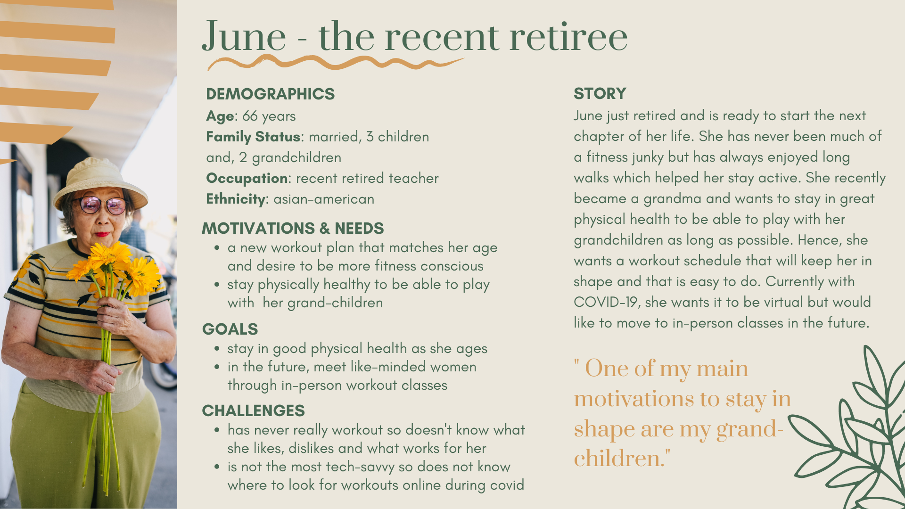
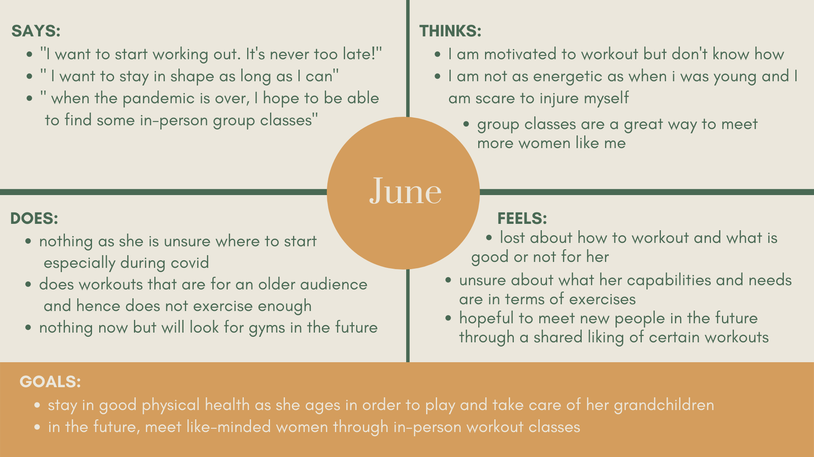

## Personas and Scenarios

### The Purpose of Storytelling

UX Storytelling reminds the researchers and designers that the experience must be user-centered. By think no longer websites based on heuristic principles and user interviews as data points, UX storytelling allows researcher to reflect on the underlying feeling and desires that users may have when completing the task and assuring that those are being satisfied by the results of the project. By creating personas, I will be able to think as the target users more generally and understand better how the current system in place does not meet their goals.

### Design Features 

Based on my previous research, I plan to implement 3 design features that I believe will help users feel incentive to workout and more confident in their choices of workout: 
* **Filters:** create an extensive possibility of filter options and categorize them easily based on needs that users may have when working out. This will allow them to  easily narrow down their choices from the thousands of options available to them on the internet. Some examples of those filters are: type of workout, level of intensity, lengths, targeted area of the body, equipment needed, type of workout (images, videos, prerecorded, live, in person, virtual), price, etc.
* **Social reviews:** the ability to have an account on the site and interact with other of the site members through chats and trusted reviews. Like the Sephora website, the reviews will give some description of who the reviewer is in order to see what people similar to you have said about the particular workout and help you see if it may fit your needs. It creates a more social component that currently cannot be recreated due to the social distancing. 
* **Quiz function:** to help beginners or people with recent changes in their capabilities (injuries, pregnancies etc.) understand what are their needs and offer them initial options to see which they like and do not like. 

### Persona & Empathy Map

#### June - the recent retiree

#### Mary - the social butterfly

#### Evalyn - the busy bee

### Scenarios & Journey Map

