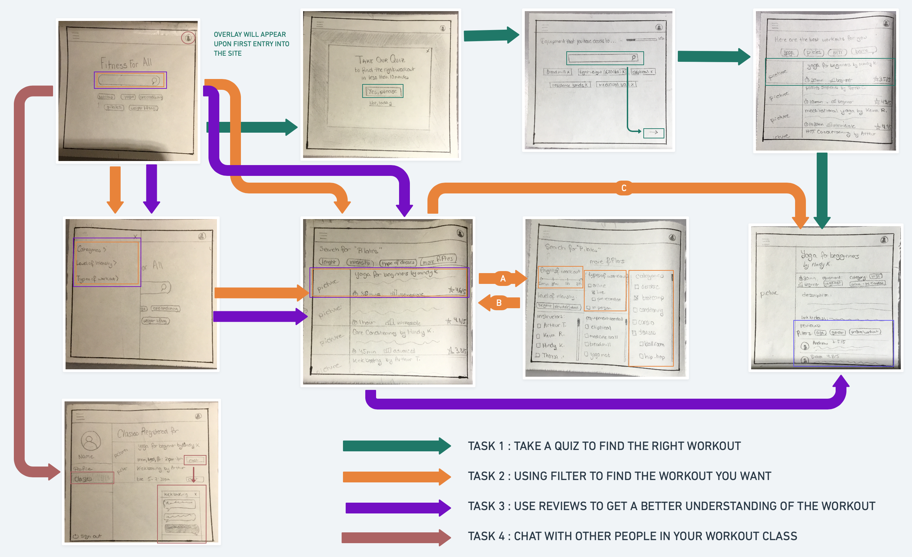
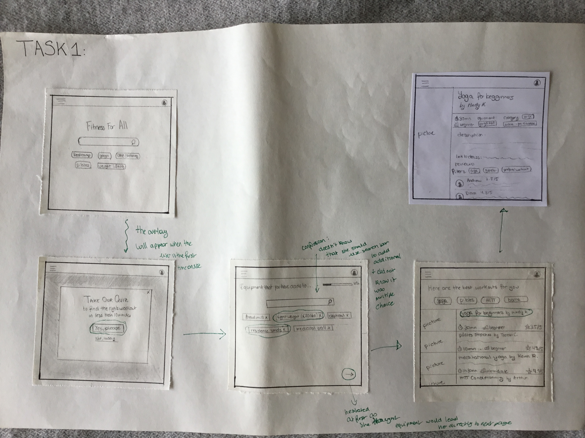
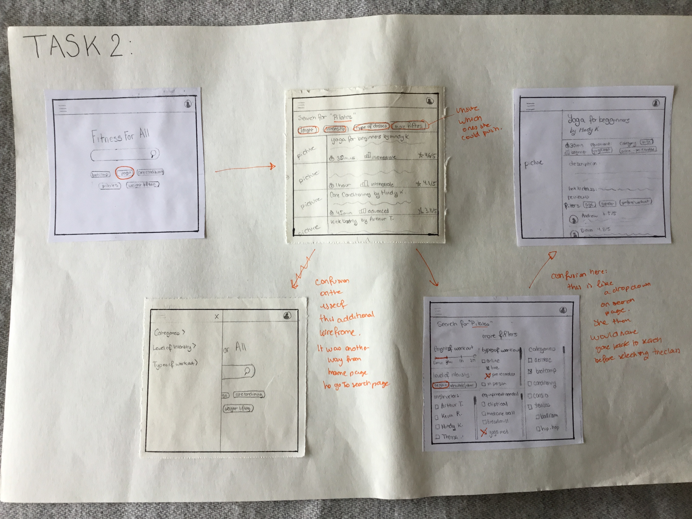
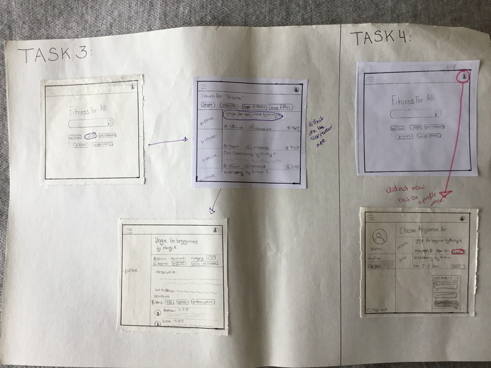
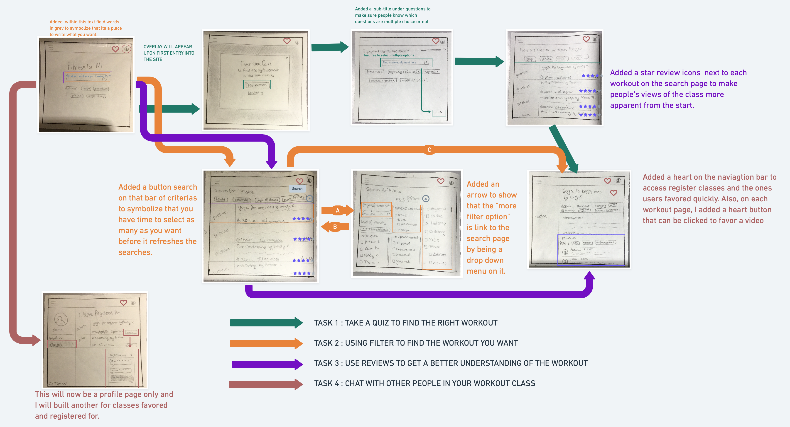

## Low Fidelity Prototype

### Overview
 * **User Research:** Over the course of the user-research done in the last 5 weeks, I have been able to find that the online fitness commnity lacks organizationa and a clear way to navigate through it. Since the start of the pandemic, a lot of gym have had to closed down and members have had to start working out at home leading to a large surge in need for online fitness without an easy way to navigate through all the options. My research has also shown that ux design wise most of the fitness site had a strong foundation. From conducting user interviews, I found that the experience of looking for a fitness class is overwhelming and takes too long, that friends opinion & social aspect of working out matter a lot, that too much information online & lack of filters makes the research frustrating at times, that price matters and that users look at pictures of the workout as a way to guage what the workout will be like. From all these key insights, I set out to draw users to better understand their feelings when going online to find a workout class as well as to find what features would be best to focus on and ameliorate during this project. 
 
 * **Personas:** During my research, I created 3 personas: June - the recent retiree, Mary - the social butterfly & Evalyn - the busy bee. I identified their needs, challenges and goals as well as created an empathy map to better understand how they felt during the process. I then used this new found understanding of my audience to create scenarios about how my key design features would help them solve any frustration they may have had during that process. I then created scenarios for that tested out how each feature could solve the frustration these personas were having. From this research, I gathered that easy to use and efficent pathways were very inportant as often times my users were either new to online fitness and needed a intuitive website to get to find a workout that works for them easily without giving up or feeling discouraged or were not novice but did not have the time to go looking through the entire internet for workouts and needed pathways that were quick and could narrow their choices accurately.
 
 * **Features:** 
 Based on my previous research, I plan to implement 3 design features that I believe will help users feel incentive to workout and more confident in their choices of workout:
    * Filters: create an extensive possibility of filter options and categorize them easily based on needs that users may have when working out. This will allow them to easily narrow down their choices from the thousands of options available to them on the internet. Some examples of those filters are: type of workout, level of intensity, lengths, targeted area of the body, equipment needed, type of workout (images, videos, prerecorded, live, in person, virtual), price, etc.
    * Social reviews: the ability to have an account on the site and interact with other of the site members through chats and trusted reviews. Like the Sephora website, the reviews will give some description of who the reviewer is in order to see what people similar to you have said about the particular workout and help you see if it may fit your needs. It creates a more social component that currently cannot be recreated due to the social distancing.
    * Quiz function: to help beginners or people with recent changes in their capabilities (injuries, pregnancies etc.) understand what are their needs and offer them initial options to see which they like and do not like.
    
 * **Purpose of low-fidelity prototype:** The purpose of this low-fidelity prototype is start planing the flow of my website as well as how each frame would look like in order to assure functionality for the users. My goal is to keep in mind my user-centric research and apply it to this low-fidelity prototype to ensure that it actually solved the user problem. I am then particularly excited to have a target audience member go through the wireframe and point out any areas that might be confusing. 

### The Tasks
For this wireframe, I will be testing out 4 tasks:
1. ***Take a quiz to find the right workout:*** The goal is to test out the flow of the quiz feature to make sure it makes sense. I did not include all the questions as that would be too many wire frames but I created at least one to ensure that the progression made sense. 
2. ***Use filters to find the workout you want:***. The goal is to test out the filter feature and to assure that is eleviating the stress of searching for a workout and making it quicker to narrow down the choices. I have only shown some of the criterias as it is only made to test functionality. 
3. ***Use reviews to get better understanding of the workout:*** The goal is to test the social reviews feature of my project. In User Testing, I found out that a lot of my target audience rely on their friends opinions to find new workouts. In part, they use their friend opinion because its someone that is similar in age, gender and lifestyle as them . In this task, I ask the user to go find the reviews for a workout they are interested in to see if where I plan to put them is the right place for people to find. 
4. ***Chat with people in your workout class:*** The goal is to test out the other part of the social component of my project. In my research, I found that people liked connect with others during workouts which is now limited due to covid. So I plan to create a social chat for people registered in a class together in order for them to talk and get to know each  

### Wireframe & Wireflow

The prototype: all the wireframes were hand-drawn and then photographed and through Whimsical, I created the wireflow. 

To download the prototype [click here](https://drive.google.com/file/d/1fqu4Xn2RN80RqU_Ewk6_iYyBqSRSe4dG/view?usp=sharing)

### Testing
After crafting the wireframe and performing a wirefont, I now had to see if it made sense to my target audience. I asked a person to test how they viewed the flow and what might be confusing about it. 

Because I had 9 wireframe in total, I decide to show only some accross each task to my users as seeing so much as once on paper might be overwelming and is to actually how they would see things on the website. I included all passage ways one could use to get the task done even if you did not need all frames to do so. 

All the lines and rounds are made by the participants. I then went in and added all the written notes to highlight where there was confusion. 

Video: Watch the video of the prototype [here](https://drive.google.com/file/d/1wAAqIMiQHWlZvw0iKLqugJiDd7kpjlr-/view?usp=sharing)

#### Task 1:

**Areas of confusion**:
* On the frame of the quiz, she was unsure if it was a multiple choice answer or single choice and failed to see that the search icon in the text box meant she could write in her answers. She did see and understand the progression bar however.
* On the same frame, she struggle with understanding if by answering it would go directly to the next page or if she had to click on the arrow in the bottom. 

#### Task 2:

**Areas of confusion**:
* This was the most confusing task to complete which proves that my filters are not efficent enought and need to be worked on further.
* On the home page, she used the quick buttons under the search bar and did not even think about typing up her search query. 
* On the search page, she was unsure which criterias she could push and how many she could choose. 
* She then got distracted by the additional home screen frame that had the naviagation pull out which was simply another way to access the search pahge.
* She  finally was confused about how to go and exit the "more filter" page and accress the video from there. 

#### Task 3 & 4: 

**Areas of confusion**:
* On task 3, she failed to see she had some insight on what others had thought of the workout through the grading and the star. 
* On task 4, she did not view the secondary page as a profile page but more as a page simply with "her" workout classes. 

### Reflection

#### The process
This week's assignment was a bit harder for me logistically than other weeks as I initially drew each frame on a piece of paper and then realized they were too close to one another and had to cut them and put them on several pieces of paper for each tasks and had to photocopy those that I needed on multiple tasks. On top of that, when I then photographed my entire wireframe & wireflow, the quality of the image made it so that what was in each frame was blurry. I then had to go back and take pictures of each frame separately and then paste them all into Whimsical to draw the flow. 

As for the testing part, I also struggled because I failed to explain well enough how to write on the wireframes I had given my participant. She therefore struggled to understand how navigate the frames and kept asking if she was doing it right as if there was a single right answer. However, her confusion also lead to discrovering some areas of improvement especially on how to get from one page to another on my website which is not currently very clear. I think, in the future, I would not draw my frames as it was then hard to export to my computer in a legible way. Additonally, maybe I would create a task 0 are frames for it that has nothing to do with my project in order to show her how she can write all over the wireframe to make the exercise more clear to my participants. 

#### Insights
From this research, I have found multiple areas of confusion for the customer in my wireframe. 
* The most confusion came from the interaction sequence. "After I click here, which page would it take me to next", "how is this page lin to the other ones?" - This is part was due to the amount of wireframes I have and how there was multiple ways to end up in the same place and it wasn't clear. 
  * Solution: I will first take out the navigation bar that can be open from the side on the home page as it is not needed with the search bar and the quick option buttons below the search bar. I will also add an arrow to show that the "more filter option" is link to the search page by being a drop down menu on it. This arrow will point down when the more filter tab is closed and up when it is open to symbolize the options in place.
* Another confusion was understanding when you could only click on one button (like in the home page with the quick search terms) or select multiple (search page filters and on the quiz that had multiple choices). 
  * Solution: For the search page filters, I plan add a button search on that bar of criterias to symbolize that you have time to select as many as you want before it refreshes the searches. For the quiz, I will put a sub-title under questions saying "feel free to select multiple options" to make sure people know which questions are multiple choice or not.
* The search bar on both the home page and the quiz page also seemed confusing to the participant even with the search glass symbol. 
  * Solution: I can add within this text field words in grey to symbolize that its a place to write what you want. For instance in the search page I could write "what workout are you looking for today?"
* There was confusion over the fact the star next to a grade out of 5 was an insight on what others had thought of the workout.
  * Solution: I can make it more usual with starts that are colored in for the grade and then writing (# of reviews) next to it to showcase what people have thought of the workout.
* What I had planed as a profile page, she saw as a page solely for classes one was registered for. 
  * Solution: Through her confusion, I was reminded of the recall vs recognition heuristic principle and realize it might be more useful to keep this link to a profile page as simply that but add a icon (probably of a heart) on the naviagtion bar where people could easily access their favorite classes and see their registered classes and chat from there. I would also add a button to favor classes on the website. 

***Here is the revise version of the wireframe & wireflow after testing it on target audience:***

  
