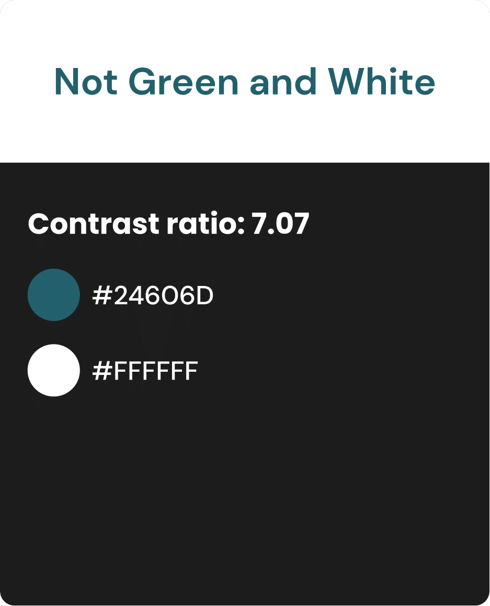
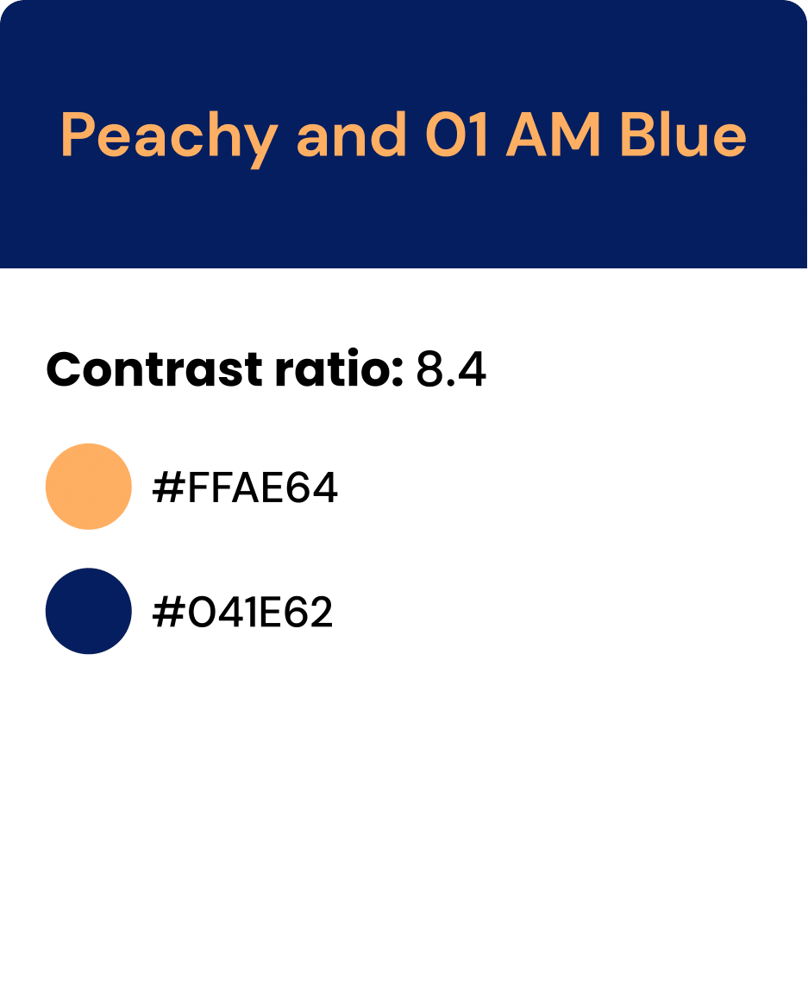
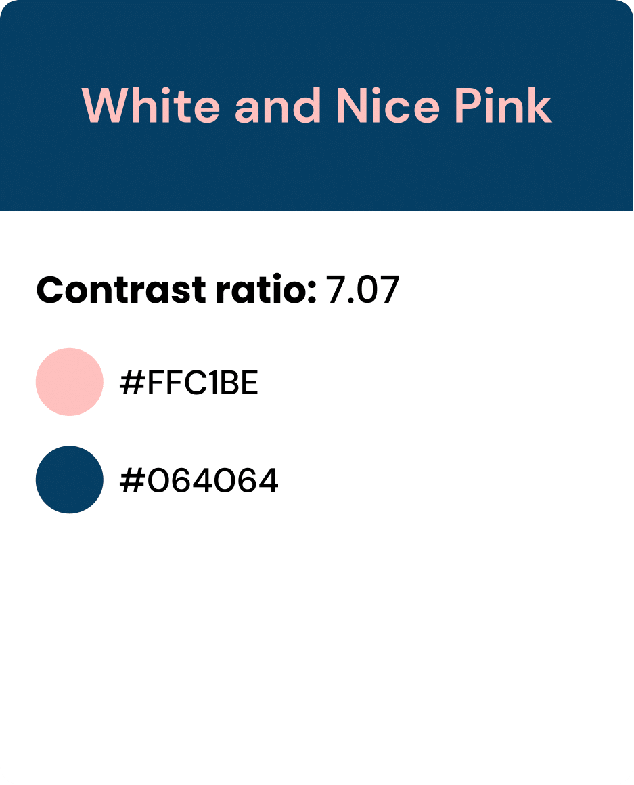

# High Fidelity Prototype
### Purpose of high-fidelity prototype

### Graphical Design Interface - Decision making 

#### 3 prototypes

||||
|--------------|----------|---------------|
||||

**To view the prototypes on figma click [here](https://www.figma.com/file/G14jgEbNAFXMyDvPlYi0Sb/prototypes-impression-test?node-id=0%3A1)**

#### Accessebilty check 
Stark was the most interesting as it helped me see how people that were colorblind view my website. 

#### Impression Test
After checking color contrast on all of them, I asked a person in my target demographic to look over all 3 prototype for 20 seconds each while saying out loud what they like and  dislike about each. I then asked them their favorite and any other feed back they may have. 

**To view the impression test click [here](https://drive.google.com/file/d/1aNxks7jcqvUBDn16wcsvn9CurTiZAMTS/view?usp=sharing)**

Overall, the participant liked prototype 2 the best and prototype 3 the least. She didn't like the monogram look and feel of the prototype 3 nore its more funky font. She also noted that the buttons were way to small for her or anyone her age and that it might be best to enlarge them. Overall protype 2 was the winner even thought she also did like the font and image on protype 1. 

#### Final Decision about Design 

### High Fidelity Prototype

#### Screen Designs

#### Wireframe

### Reflection

After having to unfortunately shift from AdobeXD to Figma, the rest of the assignment felt pretty fun. I enjoyed first coming up with color schemes and typography and then started building my frames based on my drawings. It took a while to understand certain features such as how to use overlays. I also added some great plug-ins to help me such as star maker, stories from freepik, phosphor ican and stark. 
#### How to improve for next week

#### What needs to be worked on 

