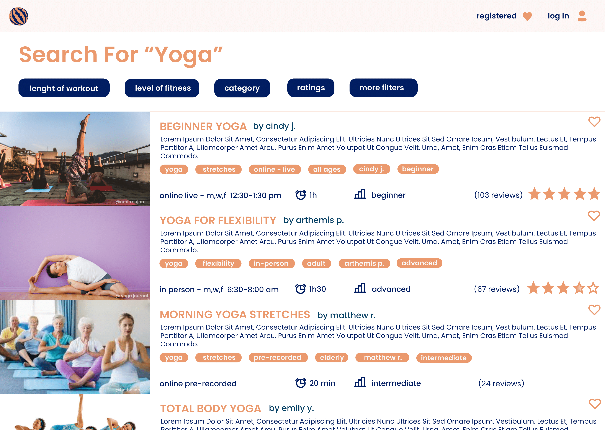

# High Fidelity Prototype
## Purpose of high-fidelity prototype

Many people have had a hard time transitioning from their gym classes to having to workout online at-home. This project sets out to create an website that facilitates working out and adapting your workout to our current way of life. 

This high-fidelity prototype is a great way to incorportate all the research I have done over the last 6 weeks into one final mockup. By building this prototype, I aim to get design a website and see what are the usability aspects (color contrast, heuristic principles,etc) that need to be improve. I also am trying to guage what is the most intuitive flow possible for my target audience.

While at first hesitating between Figma and Adobe XD, I ultimately decided to use Figma to create this prototype with the help of some plugins. I started about by drawing up various potential style for my website, then did a color contrast check and a impression test for them to decide which one I was gonna picked. Once I decided, I built out the rest of the frames and started creating a wireflow between them. 

### Tasks possible through this high-fidelity prototype
* filter options to find workout more easily
* view other people's reviews of the workout
* be able to chat with people in the classes you are registered for
* take a quiz to help you find what you need

## Graphical Design Interface - Decision making 

My decision making process too place in multiple steps. I first decided to create 3 prototypes. Each had similar structural organization based on the low-fidelity model I create last week but varied in color scheme, typography and images. For the color scheme, I looked at some accessibilty color palettes that normally would have a large enough color contrast ratio that I later rested (see **accessibility section** below). I then played around with multiple typographies before landing on 3 different 2-3 font combo. Once I had created the prototypes, I checked accessibility and then did an impression test to see what my target audience thought of my prototypes. From there, I choose my final Graphical Design protoype

### 3 prototypes
Here are the 3 prototypes. I was a big fan of using some kind of blue or blue/green with for my website and was curious to see what color combination people prefered. For the 3rd prototype, because the monochromatic look seemed more dull to me, I decided to use more fun fonts to really dissociate from the fonts I had for the other 
||||
|--------------|----------|---------------|

**To view the prototypes on figma click [here](https://www.figma.com/file/G14jgEbNAFXMyDvPlYi0Sb/prototypes-impression-test?node-id=0%3A1)**

### Accessebilty check 
To do my accessibility check, I used two different way to test out the color contrast. I first used https://contrast-ratio.com/ on all my prototypes to ensure that the color contrast ratios adhere to the WCAG2.0 AA level standard of accessibility. I then used a plug-in on Figma called Start which helped me see how people that were colorblind viewed the website. Overall, everything looked good on my final choice with Stark as the colors were very different even for people who were color blind. 

Here are the results of the first test on all my prototypes

### Impression Test
After checking color contrast on all of them, I asked a person in my target demographic to look over all 3 prototype for 20 seconds each while saying out loud what they like and  dislike about each. I then asked them their favorite and any other feed back they may have. 

**To view the impression test click [here](https://drive.google.com/file/d/1aNxks7jcqvUBDn16wcsvn9CurTiZAMTS/view?usp=sharing)**

Overall, the participant liked prototype 2 the best and prototype 3 the least. She didn't like the monochromatic look and feel of the prototype 3 nore its more funky font. She also noted that the buttons were way to small for her or anyone her age and that it might be best to enlarge them. Overall protype 2 was the winner even thought she also did like the font and image on protype 1. 

### Final Decision about Design 

## High Fidelity Prototype

**To view the full high-fidelity prototype on figma click [here](https://www.figma.com/file/O7fSlTmmPFmKkmCB7OhPwB/150-Final-Project?node-id=0%3A1)**

(https://www.figma.com/proto/O7fSlTmmPFmKkmCB7OhPwB/150-Final-Project?node-id=5%3A2989&viewport=138%2C470%2C0.08284279704093933&scaling=scale-down)**

### Screen Designs

||||
|--------------|----------|---------------|
|**Home Page**|**Search Page**|**Workout Page**|
||||
|**Login Page**|**Profile Page**|**Registered Classes Page**|

### Wireframe

**To view the full high-fidelity prototype wireflow on figma click [here](https://www.figma.com/proto/O7fSlTmmPFmKkmCB7OhPwB/150-Final-Project?node-id=5%3A2989&viewport=138%2C470%2C0.08284279704093933&scaling=scale-down)**

## Reflection

After having to unfortunately shift from AdobeXD to Figma, the rest of the assignment felt pretty fun. I enjoyed first coming up with color schemes and typography and then started building my frames based on my drawings. It took a while to understand certain features such as how to use overlays. I also added some great plug-ins to help me such as star maker, stories from freepik, phosphor ican and stark. 

### How to improve for next week

### What needs to be worked on 
* **Logo:** The logo does not truly reflect the website look and feel. While this current placeholder is necessary as it allows people to click back and go back to the home screen, it is not the best and I would like to change it for next week. 
* **Animations:** A lot of the more realistic part of the wireflow need to be added in to be a high-fidelity prototype. For example, currently on the home page, when you click on the search bar it brings you to the search page for "yoga" without anything being typed. In the final version, I'd like the keyword yoga to appear in the search bar before it leads you to the search page. However, due to the lack of time, and me focusing more on the look and feel as well as the essential framed being finished, this feature will have to wait till next week.
* **Instructor page:** 
* **Quiz Function:** 
* **Make filters interactive:**
* **Favorite vs Registered:**

