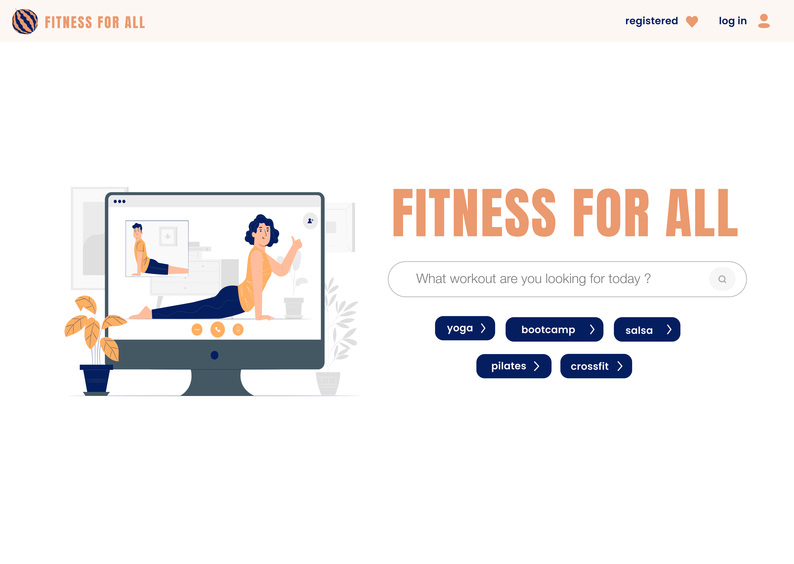
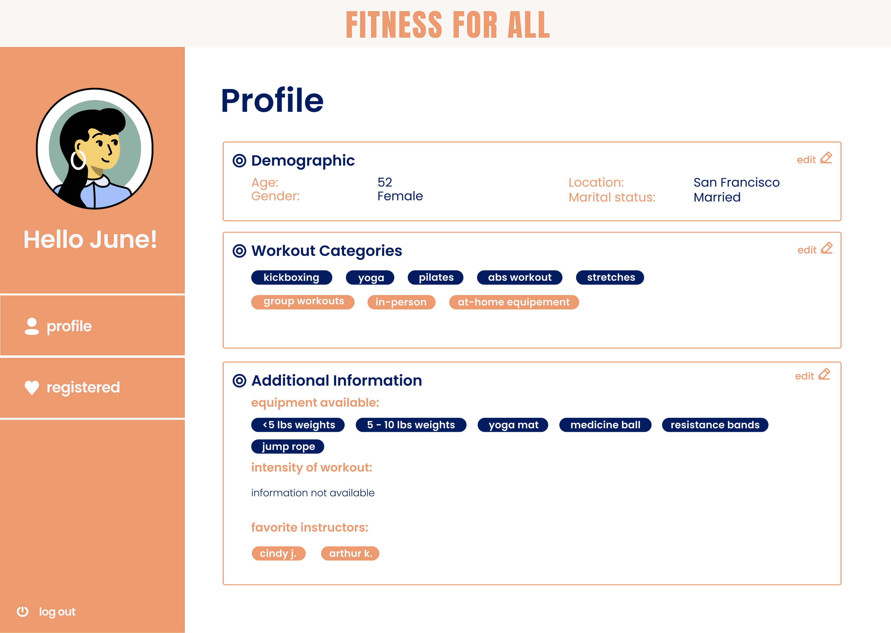
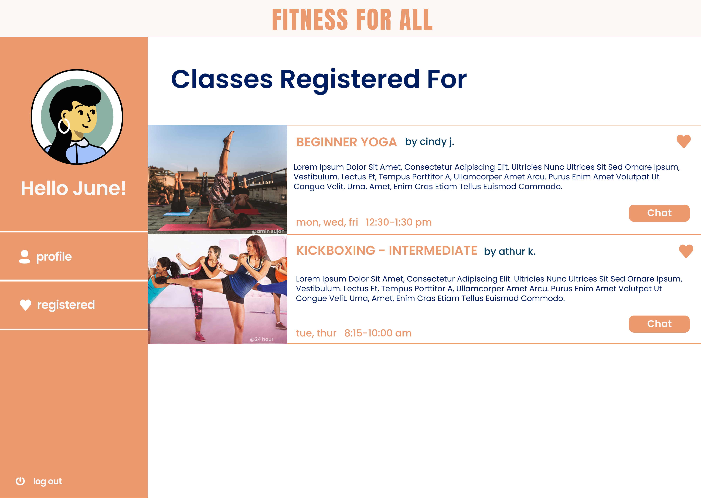
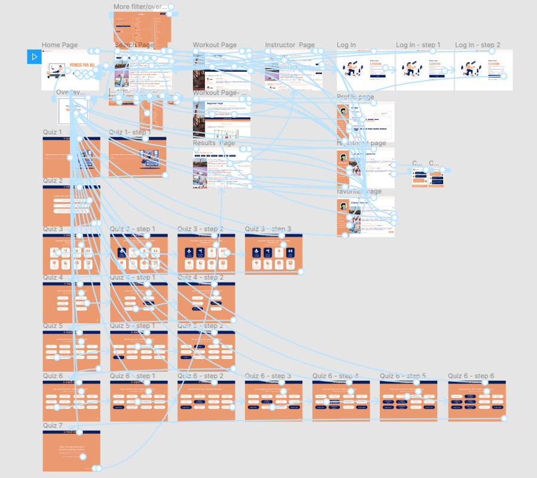

# High Fidelity Prototype
## Purpose of high-fidelity prototype

Many people have had a hard time transitioning from their gym classes to having to workout online at-home. This project sets out to create an website that facilitates working out and adapting your workout to our current way of life. 

This high-fidelity prototype is a great way to incorportate all the research I have done over the last 6 weeks into one final mockup. By building this prototype, I aim to get design a website and see what are the usability aspects (color contrast, heuristic principles,etc) that need to be improve. I also am trying to guage what is the most intuitive flow possible for my target audience.

While at first hesitating between Figma and Adobe XD, I ultimately decided to use Figma to create this prototype with the help of some plugins. I started about by drawing up various potential style for my website, then did a color contrast check and a impression test for them to decide which one I was gonna picked. Once I decided, I built out the rest of the frames and started creating a wireflow between them. 

### Tasks possible through this high-fidelity prototype
* filter options to find workout more easily
* view other people's reviews of the workout
* be able to chat with people in the classes you are registered for
* take a quiz to help you find what you need

## Graphical Design Interface - Decision making 

My decision making process too place in multiple steps. I first decided to create 3 prototypes. Each had similar structural organization based on the low-fidelity model I create last week but varied in color scheme, typography and images. For the color scheme, I looked at some accessibilty color palettes that normally would have a large enough color contrast ratio that I later rested (see **accessibility section** below). I then played around with multiple typographies before landing on 3 different 2-3 font combo. Once I had created the prototypes, I checked accessibility and then did an impression test to see what my target audience thought of my prototypes. From there, I choose my final Graphical Design protoype

### 3 prototypes
Here are the 3 prototypes. I was a big fan of using some kind of blue or blue/green with for my website and was curious to see what color combination people prefered. For the 3rd prototype, because the monochromatic look seemed more dull to me, I decided to use more fun fonts to really dissociate from the fonts I had for the other 
||||
|--------------|----------|---------------|

**To view the prototypes on figma click [here](https://www.figma.com/file/G14jgEbNAFXMyDvPlYi0Sb/prototypes-impression-test?node-id=0%3A1)**

### Accessebilty check 
To do my accessibility check, I used two different way to test out the color contrast. I first used https://contrast-ratio.com/ on all my prototypes to ensure that the color contrast ratios adhere to the WCAG2.0 AA level standard of accessibility. I then used a plug-in on Figma called Start which helped me see how people that were colorblind viewed the website. Overall, everything looked good on my final choice with Stark as the colors were very different even for people who were color blind. 

Here are the results of the first test on all my prototypes
||||
|--------------|----------|---------------|

As you can see, all 3 of my prototypes color pass the color contrast test. 

### Impression Test
After checking color contrast on all of them, I asked a person in my target demographic to look over all 3 prototype for 20 seconds each while saying out loud what they like and  dislike about each. I then asked them their favorite and any other feed back they may have. 

**To view the impression test click [here](https://drive.google.com/file/d/1aNxks7jcqvUBDn16wcsvn9CurTiZAMTS/view?usp=sharing)**

Overall, the participant liked prototype 2 the best and prototype 3 the least. She didn't like the monochromatic look and feel of the prototype 3 nore its more funky font. She also noted that the buttons were way to small for her or anyone her age and that it might be best to enlarge them. Overall protype 2 was the winner even thought she also did like the font and image on protype 1. 

### Final Decision about Design 
After having the impression test, I decided to go with the color scheme and image of the prototype 2, as it is the one the participant prefered the most (and mine too in the end!). However, I prefered the typography of prototype 1 and because the participant also was indifferent between the typography of prototype 1 & 2, I decided to make a decision. I also took into account the fact she like the illustration of the prototype 1 and decided to keep it and add it somewhere in the website with a change of colors of course. Finally, she complained about the buttons being too small and I did follow her recommendation and increased the size of the buttons on my final version which is below. 

## High-Fidelity Prototype 

### Screen Designs
Here are some of the most important screens of my website. They all have the same look and feel and are related by a lof of different passways. 

||||
|--------------|----------|---------------|
|**Home Page**|**Search Page**|**Workout Page**|
||||
|**Login Page**|**Profile Page**|**Registered Classes Page**|

**To view the full high-fidelity prototype on figma click [here](https://www.figma.com/proto/O7fSlTmmPFmKkmCB7OhPwB/150-Final-Project?node-id=5%3A2989&viewport=138%2C470%2C0.08284279704093933&scaling=scale-down)**

### Wireframe

**To view the full high-fidelity prototype wireflow on figma click [here](https://www.figma.com/file/O7fSlTmmPFmKkmCB7OhPwB/150-Final-Project?node-id=0%3A1)**

## Reflection at the end of the first week 

After having to unfortunately shift from AdobeXD to Figma, the rest of the assignment felt pretty fun. I enjoyed first coming up with color schemes and typography and then started building my frames based on my drawings. It took a while to understand certain features such as how to use overlays. I also added some great plug-ins to help me such as star maker, stories from freepik, phosphor ican and stark. 
The overall process went well but it did take a lot of time and therefor, I did not have time to finish all the parts of the prototype (which was to be expected). I created most of the main pathways and screens and all that is now left for next week is small add ons such as the filters drop down, the quiz function, and creating fake interactions especially in input fields. 

### How to improve for next week
Most of the work went on without a problem this week, however, there are two main issues I'd like to improve on for next week:
1. At first, I did not take the time to properly name each frame, group, image, icon and text and by the end, I was very lost in some of the screens and couldn't find the item I was looking for. I had to then go back and take time to understand how to group everything in an organized was which took me even longer. So next tweek, I want to improve by taking the time from the start to properly name every item and organize them effeciently.
2. I feel that my biggest limitation was how to create smooth transitions and add fake interactions in input field which is a skill I definelty want to work on throughout the week so it can be better on next week's assignment. 

### What needs to be worked on 
* **Logo:** The logo does not truly reflect the website look and feel. While this current placeholder is necessary as it allows people to click back and go back to the home screen, it is not the best and I would like to change it for next week. 
* **Animations:** A lot of the more realistic part of the wireflow need to be added in to be a high-fidelity prototype. For example, currently on the home page, when you click on the search bar it brings you to the search page for "yoga" without anything being typed. In the final version, I'd like the keyword yoga to appear in the search bar before it leads you to the search page. However, due to the lack of time, and me focusing more on the look and feel as well as the essential framed being finished, this feature will have to wait till next week.
* **Instructor page:** I haven't had the time to build this page out but it will look very similar to the workout page with reviews as well as a list of the classes they teach. 
* **Quiz Function:** I hope to create a fully form questionaire to showcase the quiz function. I did not make it this week as I really wanted to focus on getting all the main frames well done and connected before working on the auxiliary such as this. 
* **Make filters interactive:** Next week, i want to make the filters on the search page interactive. My goal, for example, is to have length have a sliding bar so people can choose the time they want. 

## New version after reflection 
After last week's impression test and the group cognitive workflow done in class, I decided to work on what I had said during my reflection and then also include some changes based on the comments of my peers. One for instance was the fact that there was no way back to the home page on the log in frame. I realized that by taking the logo out of some of the frames, users didn't know how to go back to the home screen as they got use to the logo being associated with the home screen. So I added the logo on every screen just to make sure an exit option was clear and available at all times to users. 

###  Interactive High-Fidelity Prototype 

**To view the full interactive high-fidelity prototype on figma click [here](https://www.figma.com/proto/O7fSlTmmPFmKkmCB7OhPwB/150-Final-Project-week-8?node-id=5%3A2989&viewport=157%2C258%2C0.06684868782758713&scaling=contain)

#### Wireframe

**To view the prototype wireflow on figma click [here](https://www.figma.com/file/O7fSlTmmPFmKkmCB7OhPwB/150-Final-Project-week-8?node-id=0%3A1)

### Cognitive Walk-through 
Cognitive walk-throught questions examiners about the overall look of the project as well asks them to complete a set of task and question how  easy or not it was to complete. I did one for everyone of my tasks and recorded a screenshot of the userflow. 

### Task 1 - Filters 
In this task, the user will be Evalyn, a persona that wants to use the filters to find the workout she is looking for more easily.
*See [video of walkthrough](https://drive.google.com/file/d/17BimIqeHTOu0yMdfrw9eXBtr2Jv4KXku/view?usp=sharing)
Click here to find [Comments](https://docs.google.com/document/d/1W5ElvFpQNlcbxCVg8f6cE9sfT5EHaioIs9VUQIuPaAk/edit?usp=sharing)*

 Key takeways/Things to improve on:
 * Add an input field interaction to the home page search button. 
 * Fix the scrolling for the category filter and instructor filter in the more filter options. 
 
### Task 2 - Reviews
In this task, the user will be Mary, a persona who wants to see other people’s review of the class before joining . 
*See [video of walkthrough](https://drive.google.com/file/d/1hJBQK4Y2kSr7yeT3PsaiW-zsuMIrmHrI/view?usp=sharing)
Click here to find [Comments](https://docs.google.com/document/d/1wz4o1-zOp3biWcmOOsmriijSefu9R2TCff5QE_Jn1kk/edit?usp=sharing)*

 Key takeways/Things to improve on:
 * Change the wording on the registered class page to match what it below it. 

### Task 3 - Chat
In this task, the user will be June, a persona that chat with pals in the workout classes she is registered for. 
*See [video of walkthrough](https://drive.google.com/file/d/1YEcNA0M69gDZXaZX22_DwoHmauextmMR/view?usp=sharing)
Click here to find [Comments](https://docs.google.com/document/d/1Q6pV6OsrCXwJkiJBS1TBd5Qo1B6gzKrW-JYKaLCHx2g/edit?usp=sharing)*

 Key takeways/Things to improve on:
 * Create a hover over the side buttons. 
 * Change the color of the register button to dark blue to match the other register buttons onsite and differenciate from the registered's chat buttons. 

### Task 4 - Quiz
In this task, the user will be June, a persona that is starting to workout and takes a quiz to get workouts that are right for her. 
*See [video of walkthrough](https://drive.google.com/file/d/1gV6boAQ_60jtHYWhfJrNKaPjoHwPDiLO/view?usp=sharing)
Click here to find [Comments](https://docs.google.com/document/d/1hnmmZqxYJOUKDXGOdrcz_oYNcGmHNsQTQkL4TyboKqA/edit?usp=sharing)*

 Key takeways/Things to improve on:
 * forgot to put an email field push button on the last step of the quiz.
 * one of the text on most of the quiz frame seem to have a interaction that does nothing when it is suppose to have none.

## New version after reflection 
This week's tasks were a little more tedious than last week as a lot of it was thinking about how to make transitions between frames as smooth and effective as possible. For instance, it is hard to have a button hover and also swap and some functionalities do not work hand in hand plus you need to continuously add the same frames that look a like with one small tweak to make the integration seemless. I want to improve on my skills of creating smart animations and interactions as I feel like some of mine were a bit abrupt. 

A part from that, this week assignment went quite well and I was able to incorporate all the demands set by my user research and implement all of the changes recommended through the impression test and cognitive walk-throughs. 
